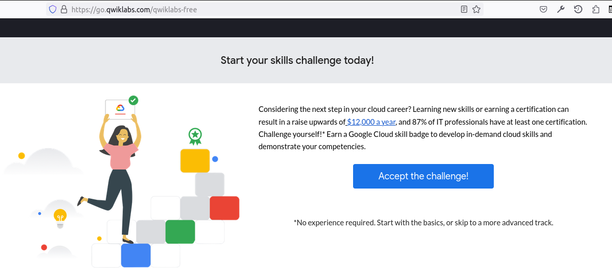

# Notes on Cloud Data Engineering

----
### Lab: [Create a Virtual Machine](https://www.cloudskillsboost.google/focuses/3563?parent=catalog)
__

Sat, 19 Mar 2022

- Tasks
    - Create a virtual machine with the Cloud Console.
    - Create a virtual machine with the gcloud command line.
    - Deploy a web server and connect it to a virtual machine.

- `gcloud`:
    ```
    # List active account name
    gcloud auth list

    # List project ID
    gcloud config list project
    ```

- Typical VM parameters:
    - 

- Install NGINX web server on a fresh VM
    ```
    sudo su -
    apt-get update
    apt-get install nginx -y

    # Check that nginx is running
    ps auwx | grep nginx
    ```

- Create a VM via cloud shell:
    ```
    gcloud compute instances create gcelab2 --machine-type n1-standard-2 --zone us-central1-f

    # Get help on CLI
    gcloud compute instances create --help

    # Set default zone and region
    gcloud config set compute/zone ...
    gcloud config set compute/region ...

    # SSH connect
    gcloud compute ssh gcelab2 --zone us-central1-f
    ```
..

----
### Lab: [Getting Started with Cloud Shell and gcloud](https://www.cloudskillsboost.google/focuses/563?parent=catalog)
__

Sat, 19 Mar 2022

- Task 1: Configure your environment
    ```
    # See default region and zone
    gcloud config get-value compute/zone
    gcloud config get-value compute/region


    # Describe project
    # gcloud compute project-info describe --project <your_project_ID>
    gcloud compute project-info describe --project qwiklabs-gcp-02-b02d242a3d87

    # Set environment variables:
    # export PROJECT_ID=<your_project_ID>
    export PROJECT_ID=qwiklabs-gcp-02-b02d242a3d87

    # export ZONE=<your_zone>
    export ZONE=us-central1-a

    # Create a VM
    gcloud compute instances create gcelab2 --machine-type n1-standard-2 --zone $ZONE

    - gcloud compute allows you to manage your Compute Engine resources in a format that's simpler than the Compute Engine API.
    - instances create creates a new instance.
    - gcelab2 is the name of the VM.
    - The --machine-type flag specifies the machine type as n1-standard-2.
    - The --zone flag specifies where the VM is created.

    If you omit the --zone flag, the gcloud tool can infer your desired zone based on your default properties. Other required instance settings, such as machine type and image, are set to default values if not specified in the create command.

    # To get help
    gcloud compute instances create --help

    # gcloud help
    gcloud -h
    gcloud config --help

    # List gcloud config
    gcloud config list                  # common user config
    gcloud config list --all            # all config

    # List gcloud components
    gcloud components list
    ```

- Task 2: Install a new component
    ```
    # Install beta components:
    sudo apt-get install google-cloud-sdk

    # Enable gcloud interactive mode:
    gcloud beta interactive

    ```

- Task 3: Connect to VM via SSH
    ```
    gcloud compute ssh gcelab2 --zone $ZONE

    ```
..

----
### A Completion Badge vs A Skill Badge in Quests
__

- A completion badge is given upon completion

- A skill badge is given after an ability is tested

- 
..


----
### Apache Beam and Google DataFlow
__

- How are they related?

- Apache Beam is the program, DataFlow is the engine

- If they were database technologies, Apache Beam would be SQL programs
  and DataFlow would be the database engine running those SQL programs

- There other pipeline runners other than Google DataFlow. But the key
  feature of DataFlow is autoscaling

- See also: https://medium.com/swlh/dataflow-and-apache-beam-the-result-of-a-learning-process-since-mapreduce-c591b2ab180e (TODO)
- Apache Beam video analytics for Football games (28:57m)
    - https://www.youtube.com/watch?v=dPuE30kY6-c
    - Design and create a platform that can handle auto-production and
      broadcasting, for up to hundreds of games per weekend with as
      little time delay as possible
..

----
### Google Cloud Offerings Group
__

- IAM & Admin (Security)
- APIs & Services
- Cloud Offerings e.g. Compute, Storage, Network, BigQuery etc..
..

----
### GSP001 - Creating a Virtual Machine
__

- Course Link:
    - https://www.cloudskillsboost.google/focuses/3563?parent=catalog
    - 40 minutes 1 Credit

- Goals
    - Create a VM on GCP
    - Create a VM using gcloud CLI
    - Deploy an NGinx web server

- Notes on Cloud Shell:
    - A VM loaded with development tools
    - 5GB persistence home directory on Google Cloud
    - In Cloud Console, click on `Activate Cloud Shell` button
    - 

- `gcloud`:
    - Docs: https://cloud.google.com/sdk/gcloud
    ```
    List active account names
        gcloud auth list

    List project ID
        gcloud config list project
    ```

- Regions and zones
    - One region has many zones
    - Naming convention: REGION-ZONE
        - Region: us-west1, Zone: a  -->  us-west1-a
        - Region: us-west1, Zone: b  -->  us-west1-b
        - Region: asia-east1, Zone: a  -->  asia-east1-a
        - etc
    - Zones are like data centers (I think)
    - Resources such as VM, Storage, etc live in zones aka data centers
..

----
### List of Google Cloud Quests
__

- BigQuery for Data Warehousing
    - https://www.cloudskillsboost.google/quests/68
    - Fundamental, 6 hours, 5 Credits

- BigQuery Basics for Data Analysts
    - https://www.cloudskillsboost.google/quests/69
    - Fundamental, 5 hours, 2 Credits
..

----
### Google API Design Guide for Cloud APIs
__

- A good read to understand Google Cloud Design principles
    - https://cloud.google.com/apis/design/
..

----
### Google APIs Explorer
__

- A useful tool to try out Google Cloud APIs
    - https://developers.google.com/apis-explorer/#p/

- A lab to try APIs Explorer
    - https://google.qwiklabs.com/catalog_lab/1241
..

----
### Data Engineer Learning Path
__

- Link:
    - https://www.cloudskillsboost.google/paths/16

- Why take this path
    - To obtain the Google Cloud Data Engineer certification

- Costs:
    - https://www.cloudskillsboost.google/payments/new
    - Buy Advantage Subscription for USD 29 (~ 1000 THB) for a monthly
      subscription and get unlimited credits
    - Possible to get a 1-month free promotion by going to 
        - https://go.qwiklabs.com/qwiklabs-free
        - Click on `Accept the challenge!`
    - 

- Courses and Quests:
    - Estimated Total:
        - 14 Days / 299 Credits
    - A Tour of Google Cloud Hands-On Labs
        - https://www.cloudskillsboost.google/focuses/2794?parent=catalog
        - 45 mins / Free
    - Google Cloud Big Data and Machine Learning Fundamentals
        - https://www.cloudskillsboost.google/course_templates/3
        - 1 day / Introductory / 20 Credits
    - Modernizing Data Lakes and Data Warehouses with Google Cloud
        - https://www.cloudskillsboost.google/course_templates/54
        - 1 day / Advanced / 20 Credits
    - Building Batch Data Pipelines on Google Cloud
        - https://www.cloudskillsboost.google/course_templates/53
        - 1 day / Advanced / 45 Credits
    - Building Resilient Streaming Analytics Systems on Google Cloud
        - https://www.cloudskillsboost.google/course_templates/52
        - 1 day / Advanced / 30 Credits
    - Smart Analytics, Machine Learning, and AI on Google Cloud
        - https://www.cloudskillsboost.google/course_templates/55
        - 1 day / Advanced / 25 Credits
    - Serverless Data Processing with Dataflow: Foundations
        - https://www.cloudskillsboost.google/course_templates/218
        - Advanced / 5 Credits
    - Serverless Data Processing with Dataflow: Develop Pipelines
        - https://www.cloudskillsboost.google/course_templates/229
        - Expert / 70 Credits
    - Serverless Data Processing with Dataflow: Operations
        - https://www.cloudskillsboost.google/course_templates/264
        - Expert / 30 Credits
    - Create and Manage Cloud Resources
        - https://www.cloudskillsboost.google/quests/120
        - 5 hours / Introductory / 6 Credits
    - Perform Foundational Data, ML, and AI Tasks in Google Cloud
        - https://www.cloudskillsboost.google/quests/117
        - 6 hours / Introductory / 16 Credits
    - Engineer Data in Google Cloud
        - https://www.cloudskillsboost.google/quests/132
        - 6 hours / Advanced / 27 Credits
    - Preparing for the Google Cloud Professional Data Engineer Exam
        - Expert / 10 Credits

- Other Relevant Courses and Quests:
    - Google Cloud Essentials
        - https://www.cloudskillsboost.google/quests/23
        - 4 hours / Introductory / 5 Credits
..

