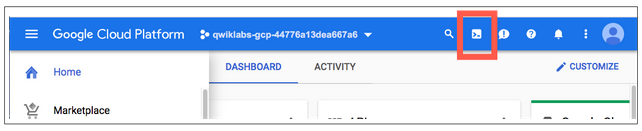

# Notes on Cloud Data Engineering

----
### Credentials
__

- Google Cloud Essentials
- See: [Latest Credentials](https://www.cloudskillsboost.google/public_profiles/70c3e8fe-77a0-45d9-a627-fa64f50ddafa)
- 
..


----
### Lab: [Predicting Visitor Purchases with a Classification Model with BigQuery ML](https://www.cloudskillsboost.google/course_sessions/887252/labs/198828)
__

Sat, 19 Mar 2022 (1hr20m 5 Credits)

- Tasks:
    - Task 1. Explore ecommerce data
    - Task 2. Select features and create your training dataset
    - Task 3. Create a BigQuery dataset to store models
    - Task 4. Select a BigQuery ML model type and specify options
    - Task 5. Evaluate classification model performance
    - Task 6. Improve model performance with feature engineering
    - Task 7. Predict which new visitors will come back and purchase

- Notes:
    - [Course dataset](https://console.cloud.google.com/bigquery?p=data-to-insights&d=ecommerce&t=web_analytics&page=table)
    - [Field Definitions](https://support.google.com/analytics/answer/3437719?hl=en)
    - [Preview Demo Dataset](https://bigquery.cloud.google.com/table/data-to-insights:ecommerce.web_analytics?tab=preview)
    - Other Models:
        - [Deep Neural Networks](https://cloud.google.com/bigquery-ml/docs/reference/standard-sql/bigqueryml-syntax-create-dnn-models)
        - [Boosted Decision Trees (XGBoost)](https://cloud.google.com/bigquery-ml/docs/reference/standard-sql/bigqueryml-syntax-create-boosted-tree)
        - [AutoML Tables Models](https://cloud.google.com/bigquery-ml/docs/reference/standard-sql/bigqueryml-syntax-create-automl)
        - [Importing Custom TensorFlow Models](https://cloud.google.com/bigquery-ml/docs/reference/standard-sql/bigqueryml-syntax-create-tensorflow)

- Task 1. Explore ecommerce data
    - Data is already in BigQuery
    - Ask: Out of the total visitors who visited our website, what % made a purchase?

```
-- 1. What % of visitors made a purchase?

#standardSQL
WITH visitors AS(
SELECT
COUNT(DISTINCT fullVisitorId) AS total_visitors
FROM `data-to-insights.ecommerce.web_analytics`
),
purchasers AS(
SELECT
COUNT(DISTINCT fullVisitorId) AS total_purchasers
FROM `data-to-insights.ecommerce.web_analytics`
WHERE totals.transactions IS NOT NULL
)
SELECT
  total_visitors,
  total_purchasers,
  total_purchasers / total_visitors AS conversion_rate
FROM visitors, purchasers


-- 2. What are the top 5 selling products?
SELECT
  p.v2ProductName,
  p.v2ProductCategory,
  SUM(p.productQuantity) AS units_sold,
  ROUND(SUM(p.localProductRevenue/1000000),2) AS revenue
FROM `data-to-insights.ecommerce.web_analytics`,
UNNEST(hits) AS h,
UNNEST(h.product) AS p
GROUP BY 1, 2
ORDER BY revenue DESC
LIMIT 5;

-- 3. How many visitors bought on subsequent visits to the website?
# visitors who bought on a return visit (could have bought on first as well
WITH all_visitor_stats AS (
SELECT
  fullvisitorid, # 741,721 unique visitors
  IF(COUNTIF(totals.transactions > 0 AND totals.newVisits IS NULL) > 0, 1, 0) AS will_buy_on_return_visit
  FROM `data-to-insights.ecommerce.web_analytics`
  GROUP BY fullvisitorid
)
SELECT
  COUNT(DISTINCT fullvisitorid) AS total_visitors,
  will_buy_on_return_visit
FROM all_visitor_stats
GROUP BY will_buy_on_return_visit
```

- Task 2. Select features and create your training dataset

```
SELECT
  * EXCEPT(fullVisitorId)
FROM
  # features
  (SELECT
    fullVisitorId,
    IFNULL(totals.bounces, 0) AS bounces,
    IFNULL(totals.timeOnSite, 0) AS time_on_site
  FROM
    `data-to-insights.ecommerce.web_analytics`
  WHERE
    totals.newVisits = 1)
  JOIN
  (SELECT
    fullvisitorid,
    IF(COUNTIF(totals.transactions > 0 AND totals.newVisits IS NULL) > 0, 1, 0) AS will_buy_on_return_visit
  FROM
      `data-to-insights.ecommerce.web_analytics`
  GROUP BY fullvisitorid)
  USING (fullVisitorId)
ORDER BY time_on_site DESC
LIMIT 10;
```

- Task 3. Create a BigQuery dataset to store models
    - Need a dataset to store models
    - Dataset ID: ecommerce

- Task 4. Select a BigQuery ML model type and specify options
    - Create a logistic regression model
    - Notice the WHERE clause that splits data into training and evaluation
    - Training takes 5-10 minutes

```
CREATE OR REPLACE MODEL `ecommerce.classification_model`
OPTIONS
(
model_type='logistic_reg',
labels = ['will_buy_on_return_visit']
)
AS
#standardSQL
SELECT
  * EXCEPT(fullVisitorId)
FROM
  # features
  (SELECT
    fullVisitorId,
    IFNULL(totals.bounces, 0) AS bounces,
    IFNULL(totals.timeOnSite, 0) AS time_on_site
  FROM
    `data-to-insights.ecommerce.web_analytics`
  WHERE
    totals.newVisits = 1
    AND date BETWEEN '20160801' AND '20170430') # train on first 9 months
  JOIN
  (SELECT
    fullvisitorid,
    IF(COUNTIF(totals.transactions > 0 AND totals.newVisits IS NULL) > 0, 1, 0) AS will_buy_on_return_visit
  FROM
      `data-to-insights.ecommerce.web_analytics`
  GROUP BY fullvisitorid)
  USING (fullVisitorId)
;
```

- Task 5. Evaluate classification model performance
    - Use Receiver Operating Characteristics (ROC) to evaluate
    - Maximize are under the curve (AUC)
    - Notice the WHERE clause now evaluates on two (2) months of data

```
SELECT
  roc_auc,
  CASE
    WHEN roc_auc > .9 THEN 'good'
    WHEN roc_auc > .8 THEN 'fair'
    WHEN roc_auc > .7 THEN 'not great'
  ELSE 'poor' END AS model_quality
FROM
  ML.EVALUATE(MODEL ecommerce.classification_model,  (
SELECT
  * EXCEPT(fullVisitorId)
FROM
  # features
  (SELECT
    fullVisitorId,
    IFNULL(totals.bounces, 0) AS bounces,
    IFNULL(totals.timeOnSite, 0) AS time_on_site
  FROM
    `data-to-insights.ecommerce.web_analytics`
  WHERE
    totals.newVisits = 1
    AND date BETWEEN '20170501' AND '20170630') # eval on 2 months
  JOIN
  (SELECT
    fullvisitorid,
    IF(COUNTIF(totals.transactions > 0 AND totals.newVisits IS NULL) > 0, 1, 0) AS will_buy_on_return_visit
  FROM
      `data-to-insights.ecommerce.web_analytics`
  GROUP BY fullvisitorid)
  USING (fullVisitorId)
));
```

- Task 6. Improve model performance with feature engineering
    - Add more features:
        - How far the visitor got in the checkout process on their first visit
        - Where visitors came from (traffic source: organic search, referring site etc.)
        - Device category (mobile, tablet, desktop)
        - Geographic information (country)
    - UNNEST() function
        - To break apart ARRAYS into separate rows. Making the table in 1NF (First Normal Form)

```
# Create second model
CREATE OR REPLACE MODEL `ecommerce.classification_model_2`
OPTIONS
  (model_type='logistic_reg', labels = ['will_buy_on_return_visit']) AS
WITH all_visitor_stats AS (
SELECT
  fullvisitorid,
  IF(COUNTIF(totals.transactions > 0 AND totals.newVisits IS NULL) > 0, 1, 0) AS will_buy_on_return_visit
  FROM `data-to-insights.ecommerce.web_analytics`
  GROUP BY fullvisitorid
)
# add in new features
SELECT * EXCEPT(unique_session_id) FROM (
  SELECT
      CONCAT(fullvisitorid, CAST(visitId AS STRING)) AS unique_session_id,
      # labels
      will_buy_on_return_visit,
      MAX(CAST(h.eCommerceAction.action_type AS INT64)) AS latest_ecommerce_progress,
      # behavior on the site
      IFNULL(totals.bounces, 0) AS bounces,
      IFNULL(totals.timeOnSite, 0) AS time_on_site,
      totals.pageviews,
      # where the visitor came from
      trafficSource.source,
      trafficSource.medium,
      channelGrouping,
      # mobile or desktop
      device.deviceCategory,
      # geographic
      IFNULL(geoNetwork.country, "") AS country
  FROM `data-to-insights.ecommerce.web_analytics`,
     UNNEST(hits) AS h
    JOIN all_visitor_stats USING(fullvisitorid)
  WHERE 1=1
    # only predict for new visits
    AND totals.newVisits = 1
    AND date BETWEEN '20160801' AND '20170430' # train 9 months
  GROUP BY
  unique_session_id,
  will_buy_on_return_visit,
  bounces,
  time_on_site,
  totals.pageviews,
  trafficSource.source,
  trafficSource.medium,
  channelGrouping,
  device.deviceCategory,
  country
);


# Evaluate the second model
#standardSQL
SELECT
  roc_auc,
  CASE
    WHEN roc_auc > .9 THEN 'good'
    WHEN roc_auc > .8 THEN 'fair'
    WHEN roc_auc > .7 THEN 'not great'
  ELSE 'poor' END AS model_quality
FROM
  ML.EVALUATE(MODEL ecommerce.classification_model_2,  (
WITH all_visitor_stats AS (
SELECT
  fullvisitorid,
  IF(COUNTIF(totals.transactions > 0 AND totals.newVisits IS NULL) > 0, 1, 0) AS will_buy_on_return_visit
  FROM `data-to-insights.ecommerce.web_analytics`
  GROUP BY fullvisitorid
)
# add in new features
SELECT * EXCEPT(unique_session_id) FROM (
  SELECT
      CONCAT(fullvisitorid, CAST(visitId AS STRING)) AS unique_session_id,
      # labels
      will_buy_on_return_visit,
      MAX(CAST(h.eCommerceAction.action_type AS INT64)) AS latest_ecommerce_progress,
      # behavior on the site
      IFNULL(totals.bounces, 0) AS bounces,
      IFNULL(totals.timeOnSite, 0) AS time_on_site,
      totals.pageviews,
      # where the visitor came from
      trafficSource.source,
      trafficSource.medium,
      channelGrouping,
      # mobile or desktop
      device.deviceCategory,
      # geographic
      IFNULL(geoNetwork.country, "") AS country
  FROM `data-to-insights.ecommerce.web_analytics`,
     UNNEST(hits) AS h
    JOIN all_visitor_stats USING(fullvisitorid)
  WHERE 1=1
    # only predict for new visits
    AND totals.newVisits = 1
    AND date BETWEEN '20170501' AND '20170630' # eval 2 months
  GROUP BY
  unique_session_id,
  will_buy_on_return_visit,
  bounces,
  time_on_site,
  totals.pageviews,
  trafficSource.source,
  trafficSource.medium,
  channelGrouping,
  device.deviceCategory,
  country
)
));
```

- Task 7. Predict which new visitors will come back and purchase

```
SELECT
*
FROM
  ml.PREDICT(MODEL `ecommerce.classification_model_2`,
   (
WITH all_visitor_stats AS (
SELECT
  fullvisitorid,
  IF(COUNTIF(totals.transactions > 0 AND totals.newVisits IS NULL) > 0, 1, 0) AS will_buy_on_return_visit
  FROM `data-to-insights.ecommerce.web_analytics`
  GROUP BY fullvisitorid
)
  SELECT
      CONCAT(fullvisitorid, '-',CAST(visitId AS STRING)) AS unique_session_id,
      # labels
      will_buy_on_return_visit,
      MAX(CAST(h.eCommerceAction.action_type AS INT64)) AS latest_ecommerce_progress,
      # behavior on the site
      IFNULL(totals.bounces, 0) AS bounces,
      IFNULL(totals.timeOnSite, 0) AS time_on_site,
      totals.pageviews,
      # where the visitor came from
      trafficSource.source,
      trafficSource.medium,
      channelGrouping,
      # mobile or desktop
      device.deviceCategory,
      # geographic
      IFNULL(geoNetwork.country, "") AS country
  FROM `data-to-insights.ecommerce.web_analytics`,
     UNNEST(hits) AS h
    JOIN all_visitor_stats USING(fullvisitorid)
  WHERE
    # only predict for new visits
    totals.newVisits = 1
    AND date BETWEEN '20170701' AND '20170801' # test 1 month
  GROUP BY
  unique_session_id,
  will_buy_on_return_visit,
  bounces,
  time_on_site,
  totals.pageviews,
  trafficSource.source,
  trafficSource.medium,
  channelGrouping,
  device.deviceCategory,
  country
)
)
ORDER BY
  predicted_will_buy_on_return_visit DESC;
```

- Challenge:
    - Use the XGBoost Classifier:
        - Use options/hyperparameters:
            - L2_reg = 0.1
            - num_parallel_tree = 8
            - max_tree-depth = 10
    - Change only one line of SQL
    - See: [Boosted Decision Trees (XGBoost)](https://cloud.google.com/bigquery-ml/docs/reference/standard-sql/bigqueryml-syntax-create-boosted-tree)

```
# 1. Train the model
CREATE OR REPLACE MODEL `ecommerce.classification_model_3`
        OPTIONS
          (model_type='BOOSTED_TREE_CLASSIFIER' , l2_reg = 0.1, num_parallel_tree = 8, max_tree_depth = 10,
              labels = ['will_buy_on_return_visit']) AS
        WITH all_visitor_stats AS (
        SELECT
          fullvisitorid,
          IF(COUNTIF(totals.transactions > 0 AND totals.newVisits IS NULL) > 0, 1, 0) AS will_buy_on_return_visit
          FROM `data-to-insights.ecommerce.web_analytics`
          GROUP BY fullvisitorid
        )
        # add in new features
        SELECT * EXCEPT(unique_session_id) FROM (
          SELECT
              CONCAT(fullvisitorid, CAST(visitId AS STRING)) AS unique_session_id,
              # labels
              will_buy_on_return_visit,
              MAX(CAST(h.eCommerceAction.action_type AS INT64)) AS latest_ecommerce_progress,
              # behavior on the site
              IFNULL(totals.bounces, 0) AS bounces,
              IFNULL(totals.timeOnSite, 0) AS time_on_site,
              totals.pageviews,
              # where the visitor came from
              trafficSource.source,
              trafficSource.medium,
              channelGrouping,
              # mobile or desktop
              device.deviceCategory,
              # geographic
              IFNULL(geoNetwork.country, "") AS country
          FROM `data-to-insights.ecommerce.web_analytics`,
             UNNEST(hits) AS h
            JOIN all_visitor_stats USING(fullvisitorid)
          WHERE 1=1
            # only predict for new visits
            AND totals.newVisits = 1
            AND date BETWEEN '20160801' AND '20170430' # train 9 months
          GROUP BY
          unique_session_id,
          will_buy_on_return_visit,
          bounces,
          time_on_site,
          totals.pageviews,
          trafficSource.source,
          trafficSource.medium,
          channelGrouping,
          device.deviceCategory,
          country
        );


# 2. Evaluate the model
#standardSQL
SELECT
  roc_auc,
  CASE
    WHEN roc_auc > .9 THEN 'good'
    WHEN roc_auc > .8 THEN 'fair'
    WHEN roc_auc > .7 THEN 'not great'
  ELSE 'poor' END AS model_quality
FROM
  ML.EVALUATE(MODEL ecommerce.classification_model_3,  (
WITH all_visitor_stats AS (
SELECT
  fullvisitorid,
  IF(COUNTIF(totals.transactions > 0 AND totals.newVisits IS NULL) > 0, 1, 0) AS will_buy_on_return_visit
  FROM `data-to-insights.ecommerce.web_analytics`
  GROUP BY fullvisitorid
)
# add in new features
SELECT * EXCEPT(unique_session_id) FROM (
  SELECT
      CONCAT(fullvisitorid, CAST(visitId AS STRING)) AS unique_session_id,
      # labels
      will_buy_on_return_visit,
      MAX(CAST(h.eCommerceAction.action_type AS INT64)) AS latest_ecommerce_progress,
      # behavior on the site
      IFNULL(totals.bounces, 0) AS bounces,
      IFNULL(totals.timeOnSite, 0) AS time_on_site,
      totals.pageviews,
      # where the visitor came from
      trafficSource.source,
      trafficSource.medium,
      channelGrouping,
      # mobile or desktop
      device.deviceCategory,
      # geographic
      IFNULL(geoNetwork.country, "") AS country
  FROM `data-to-insights.ecommerce.web_analytics`,
     UNNEST(hits) AS h
    JOIN all_visitor_stats USING(fullvisitorid)
  WHERE 1=1
    # only predict for new visits
    AND totals.newVisits = 1
    AND date BETWEEN '20170501' AND '20170630' # eval 2 months
  GROUP BY
  unique_session_id,
  will_buy_on_return_visit,
  bounces,
  time_on_site,
  totals.pageviews,
  trafficSource.source,
  trafficSource.medium,
  channelGrouping,
  device.deviceCategory,
  country
)
));


# 3. Make Predictions
SELECT
*
FROM
  ml.PREDICT(MODEL `ecommerce.classification_model_3`,
   (
WITH all_visitor_stats AS (
SELECT
  fullvisitorid,
  IF(COUNTIF(totals.transactions > 0 AND totals.newVisits IS NULL) > 0, 1, 0) AS will_buy_on_return_visit
  FROM `data-to-insights.ecommerce.web_analytics`
  GROUP BY fullvisitorid
)
  SELECT
      CONCAT(fullvisitorid, '-',CAST(visitId AS STRING)) AS unique_session_id,
      # labels
      will_buy_on_return_visit,
      MAX(CAST(h.eCommerceAction.action_type AS INT64)) AS latest_ecommerce_progress,
      # behavior on the site
      IFNULL(totals.bounces, 0) AS bounces,
      IFNULL(totals.timeOnSite, 0) AS time_on_site,
      totals.pageviews,
      # where the visitor came from
      trafficSource.source,
      trafficSource.medium,
      channelGrouping,
      # mobile or desktop
      device.deviceCategory,
      # geographic
      IFNULL(geoNetwork.country, "") AS country
  FROM `data-to-insights.ecommerce.web_analytics`,
     UNNEST(hits) AS h
    JOIN all_visitor_stats USING(fullvisitorid)
  WHERE
    # only predict for new visits
    totals.newVisits = 1
    AND date BETWEEN '20170701' AND '20170801' # test 1 month
  GROUP BY
  unique_session_id,
  will_buy_on_return_visit,
  bounces,
  time_on_site,
  totals.pageviews,
  trafficSource.source,
  trafficSource.medium,
  channelGrouping,
  device.deviceCategory,
  country
)
)
ORDER BY
  predicted_will_buy_on_return_visit DESC;
```
..


----
### Lab: [Set Up Network and HTTP Load Balancers](https://www.cloudskillsboost.google/focuses/12007?parent=catalog)
__

Sat, 19 Mar 2022

- Tasks:
    - Task 1: Set the default region and zone for all resources
    - Task 2: Create multiple web server instances
    - Task 3: Configure the load balancing service
    - Task 4: Sending traffic to your instances
    - Task 5: Create an HTTP load balancer
    - Task 6: Testing traffic sent to your instances

- Notes:
    - The gcloud create instance is quite powerful, allowing arbitrary
      startup scripts e.g. installing apache and customizing the default
      home page
    - `gcloud compute ... create` commands:
        - addresses: Static, public IP address
        - http-health-checks: Health check resource (Legacy)
        - target-pools: Targets for IP Forwarding
        - forwarding-rules: IP Forwarding rule
        - firewall rules: Firewall rule
        - instance-templates: Templates for instances
        - instance-groups managed: Managed instance groups
        - health-checks: Health check resource
        - backend-services: A grouping of instances like target pools
        - url-maps: URL rules to map requests to backend services. This
          is a load balancer!
        - target-http-proxies: HTTP proxy to route requests to url map
    - The step in Task 3 differs from Task 5:
        - Task 3: Load balancing results from using a combination of
          forwarding rules and target pool
        - Task 5: Load balancing results from grouping the instances in
          a `backend service`
        - The target-pool + forwarding-rule in Task 3 maps to
          backend-service + url-map + target-http-proxy in Task 5. One
          more level of indirection
    - Task 5 takes awhile to come up to wait a bit before clicking on
      the `Check my progress` button
    - [YouTube video](https://youtu.be/1ZW59HrRUzw)

- Task 1: Set the default region and zone for all resources
    ```
    gcloud config set compute/zone us-central1-a
    gcloud config set compute/region us-central1
    ```

- Task 2: Create multiple web server instances
    - The `tags` attribute is used to group resources
    - Below, the `network-lb-tag` is common to all three instances
    ```
    # Create web server "www1"
    gcloud compute instances create www1 \
      --image-family debian-9 \
      --image-project debian-cloud \
      --zone us-central1-a \
      --tags network-lb-tag \
      --metadata startup-script="#! /bin/bash
        sudo apt-get update
        sudo apt-get install apache2 -y
        sudo service apache2 restart
        echo '<!doctype html><html><body><h1>www1</h1></body></html>' | tee /var/www/html/index.html"

    # Create web server "www2"
    gcloud compute instances create www2 \
      --image-family debian-9 \
      --image-project debian-cloud \
      --zone us-central1-a \
      --tags network-lb-tag \
      --metadata startup-script="#! /bin/bash
        sudo apt-get update
        sudo apt-get install apache2 -y
        sudo service apache2 restart
        echo '<!doctype html><html><body><h1>www2</h1></body></html>' | tee /var/www/html/index.html"

    # Create web server "www3"
    gcloud compute instances create www3 \
      --image-family debian-9 \
      --image-project debian-cloud \
      --zone us-central1-a \
      --tags network-lb-tag \
      --metadata startup-script="#! /bin/bash
        sudo apt-get update
        sudo apt-get install apache2 -y
        sudo service apache2 restart
        echo '<!doctype html><html><body><h1>www3</h1></body></html>' | tee /var/www/html/index.html"

    # Create firewall rule:
    - Note the value of `target-tags`
    gcloud compute firewall-rules create www-firewall-network-lb \
        --target-tags network-lb-tag --allow tcp:80

    # List each instance to see external IP
    gcloud compute instances list

    # Run curl to check each instance
    curl http://35.224.73.148
    curl http://34.67.240.70
    curl http://35.184.186.55
    ```

- Task 3: Configure the load balancing service
    ```
    # Create a static, public IP for load balancer
    gcloud compute addresses create network-lb-ip-1 \
        --region us-central1

    # Create a legacy HTTP health check resource
    gcloud compute http-health-checks create basic-check

    # Create an empty target pool in the same region and use the
    #   health-check above.
    gcloud compute target-pools create www-pool \
        --region us-central1 --http-health-check basic-check

    # Add compute instances to the pool
    gcloud compute target-pools add-instances www-pool \
        --instances www1,www2,www3

    # Add a forwarding rule. Forwarding requests to the static, public
    # IP to the target pool containing the three web server instances
    gcloud compute forwarding-rules create www-rule \
        --region us-central1 \
        --ports 80 \
        --address network-lb-ip-1 \
        --target-pool www-pool
    ```

- Task 4: Sending traffic to your instances
    ```
    # View the forwarding rule
    gcloud compute forwarding-rules describe www-rule --region us-central1

    # Access the external IP address continuously
    while true; do curl -m1 34.68.108.146; done
    ```

- Task 5: Create an HTTP load balancer
    ```
    # 1. Create an instance template
    gcloud compute instance-templates create lb-backend-template \
       --region=us-central1 \
       --network=default \
       --subnet=default \
       --tags=allow-health-check \
       --image-family=debian-9 \
       --image-project=debian-cloud \
       --metadata=startup-script='#! /bin/bash
         apt-get update
         apt-get install apache2 -y
         a2ensite default-ssl
         a2enmod ssl
         vm_hostname="$(curl -H "Metadata-Flavor:Google" \
         http://169.254.169.254/computeMetadata/v1/instance/name)"
         echo "Page served from: $vm_hostname" | \
         tee /var/www/html/index.html
         systemctl restart apache2'

    # 2. Create a managed instance group using above template:
    gcloud compute instance-groups managed create lb-backend-group \
       --template=lb-backend-template --size=2 --zone=us-central1-a

    # 3. Create a firewall rule. The `target-tags` identify the affected instances
    gcloud compute firewall-rules create fw-allow-health-check \
        --network=default \
        --action=allow \
        --direction=ingress \
        --source-ranges=130.211.0.0/22,35.191.0.0/16 \
        --target-tags=allow-health-check \
        --rules=tcp:80

    # 4a. Create a static, external IP address
    gcloud compute addresses create lb-ipv4-1 \
        --ip-version=IPV4 \
        --global

    # 4b. Note the IP address reserved
    gcloud compute addresses describe lb-ipv4-1 \
        --format="get(address)" \
        --global
        # 34.120.130.89 (xxx)

    # 5. Create a health check for the load balancer
    gcloud compute health-checks create http http-basic-check \
        --port 80

    # 6. Create a backend service
    gcloud compute backend-services create web-backend-service \
        --protocol=HTTP \
        --port-name=http \
        --health-checks=http-basic-check \
        --global

    # 7. Add instance group to backend service
    gcloud compute backend-services add-backend web-backend-service \
        --instance-group=lb-backend-group \
        --instance-group-zone=us-central1-a \
        --global

    # 8. Create a URL map to send requests to backend service. This is
    #    the load balancer!
    gcloud compute url-maps create web-map-http \
        --default-service web-backend-service

    # 9. Create a target HTTP proxy to route requests to URL map
    gcloud compute target-http-proxies create http-lb-proxy \
        --url-map web-map-http

    # 10. Create forwarding rule to send requests to proxy
    gcloud compute forwarding-rules create http-content-rule \
        --address=lb-ipv4-1\
        --global \
        --target-http-proxy=http-lb-proxy \
        --ports=80
    ```

- Task 6: Testing traffic sent to your instances


..

----
### Lab: [Kubernetes Engine: Qwik Start](https://www.cloudskillsboost.google/focuses/878?parent=catalog)
__

Sat, 19 Mar 2022

- Tasks
    - Task 1: Set a default compute zone
    - Task 2: Create a GKE cluster
    - Task 3: Get authentication credentials for the cluster

- Notes:
    - Creating and deleting the cluster takes awhile so best to read
      through the lab in its entirety before starting the lab
    - [`Manage Containerized Apps with Kubernetes Engine`](https://youtu.be/u9nsngvmMK4)

- Task 1: Set a default compute zone
    ```
    # Set default zone
    gcloud config set compute/zone us-central1-a
    ```

- Task 2: Create a GKE cluster
    - A cluster has a cluster master and several workers called nodes
    - Note: Cluster names must start with a letter and end with an
      alphanumeric, and cannot be longer than 40 characters.
    ```
    # Create a cluster
    # gcloud container clusters create [CLUSTER-NAME]
    gcloud container clusters create my-cluster
    ```

- Task 3: Get authentication credentials for the cluster
    - Auth credentials needed to interact with cluster
    ```
    # Get cluster credentials
    # gcloud container clusters get-credentials [CLUSTER-NAME]
    gcloud container clusters get-credentials my-cluster
    ```

- Task 4: Deploy an application to the cluster
    - Lab deploys a hello-app
    - `Deployment` objects are for stateless applications like web servers
    - `Service` objects define rules and load balancing for accessing
      app from the net
    ```
    # Create a new Deployment of 'hello-server' from a pre-defined container image
    kubectl create deployment hello-server --image=gcr.io/google-samples/hello-app:1.0
    # Expect: deployment.apps/hello-server created

    # Create a Service, which exposes app to external traffic
    kubectl expose deployment hello-server --type=LoadBalancer --port 8080
    # Expect: service/hello-server exposed

    # Inspect service:
    kubectl get service
    # Expect: NAME  TYPE    CLUSTER-IP  EXTERNAL-IP    PORT(S)    AGE
    ```

- Task 5: Deleting the cluster
    ```
    # gcloud container clusters delete [CLUSTER-NAME]
    gcloud container clusters delete my-cluster

    ```
- Resources:
..

----
### Lab: [Create a Virtual Machine](https://www.cloudskillsboost.google/focuses/3563?parent=catalog)
__

Sat, 19 Mar 2022

- Tasks
    - Create a virtual machine with the Cloud Console.
    - Create a virtual machine with the gcloud command line.
    - Deploy a web server and connect it to a virtual machine.

- `gcloud`:
    ```
    # List active account name
    gcloud auth list

    # List project ID
    gcloud config list project
    ```

- Typical VM parameters:
    - 

- Install NGINX web server on a fresh VM
    ```
    sudo su -
    apt-get update
    apt-get install nginx -y

    # Check that nginx is running
    ps auwx | grep nginx
    ```

- Create a VM via cloud shell:
    ```
    gcloud compute instances create gcelab2 --machine-type n1-standard-2 --zone us-central1-f

    # Get help on CLI
    gcloud compute instances create --help

    # Set default zone and region
    gcloud config set compute/zone ...
    gcloud config set compute/region ...

    # SSH connect
    gcloud compute ssh gcelab2 --zone us-central1-f
    ```
..


----
### Lab: [Getting Started with Cloud Shell and gcloud](https://www.cloudskillsboost.google/focuses/563?parent=catalog)
__

Sat, 19 Mar 2022

- Task 1: Configure your environment
    ```
    # See default region and zone
    gcloud config get-value compute/zone
    gcloud config get-value compute/region

    # Describe project
    # gcloud compute project-info describe --project <your_project_ID>
    gcloud compute project-info describe --project qwiklabs-gcp-02-b02d242a3d87

    # Set environment variables:
    # export PROJECT_ID=<your_project_ID>
    export PROJECT_ID=qwiklabs-gcp-02-b02d242a3d87

    # export ZONE=<your_zone>
    export ZONE=us-central1-a

    # Create a VM
    gcloud compute instances create gcelab2 --machine-type n1-standard-2 --zone $ZONE

    - gcloud compute allows you to manage your Compute Engine resources in a format that's simpler than the Compute Engine API.
    - instances create creates a new instance.
    - gcelab2 is the name of the VM.
    - The --machine-type flag specifies the machine type as n1-standard-2.
    - The --zone flag specifies where the VM is created.

    If you omit the --zone flag, the gcloud tool can infer your desired zone based on your default properties. Other required instance settings, such as machine type and image, are set to default values if not specified in the create command.

    # To get help
    gcloud compute instances create --help

    # gcloud help
    gcloud -h
    gcloud config --help

    # List gcloud config
    gcloud config list                  # common user config
    gcloud config list --all            # all config

    # List gcloud components
    gcloud components list
    ```

- Task 2: Install a new component
    ```
    # Install beta components:
    sudo apt-get install google-cloud-sdk

    # Enable gcloud interactive mode:
    gcloud beta interactive

    ```

- Task 3: Connect to VM via SSH
    ```
    gcloud compute ssh gcelab2 --zone $ZONE

    ```
..


----
### A Completion Badge vs A Skill Badge in Quests
__

- A completion badge is given upon completion

- A skill badge is given after an ability is tested

- 
..


----
### Apache Beam and Google DataFlow
__

- How are they related?

- Apache Beam is the program, DataFlow is the engine

- If they were database technologies, Apache Beam would be SQL programs
  and DataFlow would be the database engine running those SQL programs

- There other pipeline runners other than Google DataFlow. But the key
  feature of DataFlow is autoscaling

- See also: https://medium.com/swlh/dataflow-and-apache-beam-the-result-of-a-learning-process-since-mapreduce-c591b2ab180e (TODO)
- Apache Beam video analytics for Football games (28:57m)
    - https://www.youtube.com/watch?v=dPuE30kY6-c
    - Design and create a platform that can handle auto-production and
      broadcasting, for up to hundreds of games per weekend with as
      little time delay as possible
..


----
### Google Cloud Offerings Group
__

- IAM & Admin (Security)
- APIs & Services
- Cloud Offerings e.g. Compute, Storage, Network, BigQuery etc..
..


----
### GSP001 - Creating a Virtual Machine
__

- Course Link:
    - https://www.cloudskillsboost.google/focuses/3563?parent=catalog
    - 40 minutes 1 Credit

- Goals
    - Create a VM on GCP
    - Create a VM using gcloud CLI
    - Deploy an NGinx web server

- Notes on Cloud Shell:
    - A VM loaded with development tools
    - 5GB persistence home directory on Google Cloud
    - In Cloud Console, click on `Activate Cloud Shell` button
    - 

- `gcloud`:
    - Docs: https://cloud.google.com/sdk/gcloud
    ```
    List active account names
        gcloud auth list

    List project ID
        gcloud config list project
    ```

- Regions and zones
    - One region has many zones
    - Naming convention: REGION-ZONE
        - Region: us-west1, Zone: a  -->  us-west1-a
        - Region: us-west1, Zone: b  -->  us-west1-b
        - Region: asia-east1, Zone: a  -->  asia-east1-a
        - etc
    - Zones are like data centers (I think)
    - Resources such as VM, Storage, etc live in zones aka data centers
..


----
### List of Google Cloud Quests
__

- BigQuery for Data Warehousing
    - https://www.cloudskillsboost.google/quests/68
    - Fundamental, 6 hours, 5 Credits

- BigQuery Basics for Data Analysts
    - https://www.cloudskillsboost.google/quests/69
    - Fundamental, 5 hours, 2 Credits

- Courses, Quests and Labs for Data Engineer Role:
    - https://www.cloudskillsboost.google/catalog?keywords=&locale=&solution%5B%5D=any&role%5B%5D=data-engineer&skill-badge%5B%5D=any&format%5B%5D=any&level%5B%5D=any&duration%5B%5D=any&language%5B%5D=any

..


----
### Google API Design Guide for Cloud APIs
__

- A good read to understand Google Cloud Design principles
    - https://cloud.google.com/apis/design/
..


----
### Google APIs Explorer
__

- A useful tool to try out Google Cloud APIs
    - https://developers.google.com/apis-explorer/#p/

- A lab to try APIs Explorer
    - https://google.qwiklabs.com/catalog_lab/1241
..


----
### Data Engineer Learning Path
__

- Link:
    - https://www.cloudskillsboost.google/paths/16

- Why take this path
    - To obtain the Google Cloud Data Engineer certification

- Costs:
    - https://www.cloudskillsboost.google/payments/new
    - Buy Advantage Subscription for USD 29 (~ 1000 THB) for a monthly
      subscription and get unlimited credits
    - Possible to get a 1-month free promotion by going to 
        - https://go.qwiklabs.com/qwiklabs-free
        - Click on `Accept the challenge!`
    - 

- Courses and Quests:
    - Estimated Total:
        - 14 Days / 299 Credits
    - A Tour of Google Cloud Hands-On Labs
        - https://www.cloudskillsboost.google/focuses/2794?parent=catalog
        - 45 mins / Free
    - Google Cloud Big Data and Machine Learning Fundamentals
        - https://www.cloudskillsboost.google/course_templates/3
        - 1 day / Introductory / 20 Credits
    - Modernizing Data Lakes and Data Warehouses with Google Cloud
        - https://www.cloudskillsboost.google/course_templates/54
        - 1 day / Advanced / 20 Credits
    - Building Batch Data Pipelines on Google Cloud
        - https://www.cloudskillsboost.google/course_templates/53
        - 1 day / Advanced / 45 Credits
    - Building Resilient Streaming Analytics Systems on Google Cloud
        - https://www.cloudskillsboost.google/course_templates/52
        - 1 day / Advanced / 30 Credits
    - Smart Analytics, Machine Learning, and AI on Google Cloud
        - https://www.cloudskillsboost.google/course_templates/55
        - 1 day / Advanced / 25 Credits
    - Serverless Data Processing with Dataflow: Foundations
        - https://www.cloudskillsboost.google/course_templates/218
        - Advanced / 5 Credits
    - Serverless Data Processing with Dataflow: Develop Pipelines
        - https://www.cloudskillsboost.google/course_templates/229
        - Expert / 70 Credits
    - Serverless Data Processing with Dataflow: Operations
        - https://www.cloudskillsboost.google/course_templates/264
        - Expert / 30 Credits
    - Create and Manage Cloud Resources
        - https://www.cloudskillsboost.google/quests/120
        - 5 hours / Introductory / 6 Credits
    - Perform Foundational Data, ML, and AI Tasks in Google Cloud
        - https://www.cloudskillsboost.google/quests/117
        - 6 hours / Introductory / 16 Credits
    - Engineer Data in Google Cloud
        - https://www.cloudskillsboost.google/quests/132
        - 6 hours / Advanced / 27 Credits
    - Preparing for the Google Cloud Professional Data Engineer Exam
        - Expert / 10 Credits

- Other Relevant Courses and Quests:
    - Google Cloud Essentials
        - https://www.cloudskillsboost.google/quests/23
        - 4 hours / Introductory / 5 Credits
..

