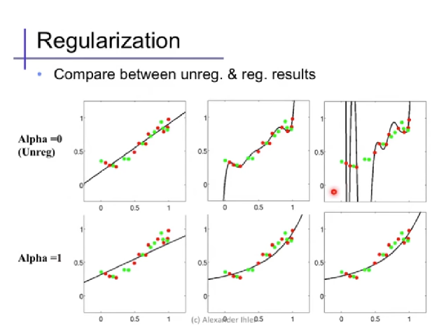
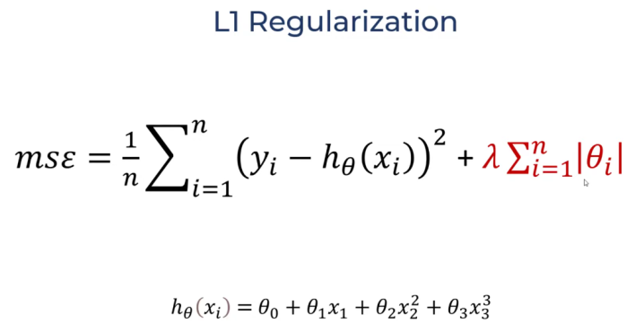
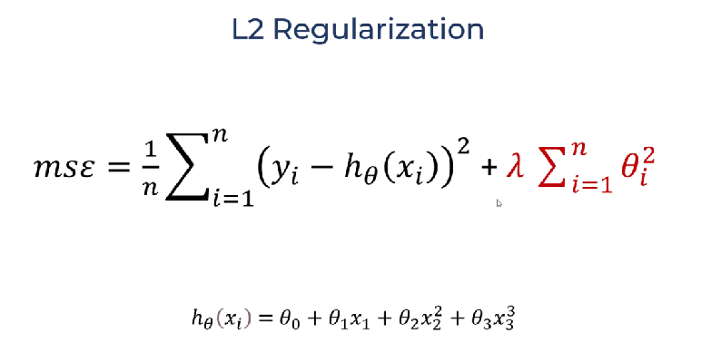

# Professional Data Engineer

__ **Certification exam guide**

    `A Professional Data Engineer enables data-driven decision-making by collecting, transforming, and publishing data. A data engineer should be able to design, build, operationalize, secure, and monitor data processing systems with a particular emphasis on security and compliance; scalability and efficiency; reliability and fidelity; and flexibility and portability. A data engineer should also be able to leverage, deploy, and continuously train pre-existing machine learning models.`
..

__ **Section 1. Designing data processing systems**

1.1 Selecting the appropriate storage technologies. Considerations include:

        Mapping storage systems to business requirements
        Data modeling
        Trade-offs involving latency, throughput, transactions
        Distributed systems
        Schema design

1.2 Designing data pipelines. Considerations include:

        Data publishing and visualization (e.g., BigQuery)
        Batch and streaming data (e.g., Dataflow, Dataproc, Apache Beam, Apache Spark and Hadoop ecosystem, Pub/Sub, Apache Kafka)
        Online (interactive) vs. batch predictions
        Job automation and orchestration (e.g., Cloud Composer)

1.3 Designing a data processing solution. Considerations include:

        Choice of infrastructure
        System availability and fault tolerance
        Use of distributed systems
        Capacity planning
        Hybrid cloud and edge computing
        Architecture options (e.g., message brokers, message queues, middleware, service-oriented architecture, serverless functions)
        At least once, in-order, and exactly once, etc., event processing

1.4 Migrating data warehousing and data processing. Considerations include:

        Awareness of current state and how to migrate a design to a future state
        Migrating from on-premises to cloud (Data Transfer Service, Transfer Appliance, Cloud Networking)
        Validating a migration
..

__ **Section 2. Building and operationalizing data processing systems**

2.1 Building and operationalizing storage systems. Considerations include:

        Effective use of managed services (Cloud Bigtable, Cloud Spanner, Cloud SQL, BigQuery, Cloud Storage, Datastore, Memorystore)
        Storage costs and performance
        Life cycle management of data

2.2 Building and operationalizing pipelines. Considerations include:

        Data cleansing
        Batch and streaming
        Transformation
        Data acquisition and import
        Integrating with new data sources

2.3 Building and operationalizing processing infrastructure. Considerations include:

        Provisioning resources
        Monitoring pipelines
        Adjusting pipelines
        Testing and quality control
..

__ **Section 3. Operationalizing machine learning models**

3.1 Leveraging pre-built ML models as a service. Considerations include:

        ML APIs (e.g., Vision API, Speech API)
        Customizing ML APIs (e.g., AutoML Vision, Auto ML text)
        Conversational experiences (e.g., Dialogflow)

3.2 Deploying an ML pipeline. Considerations include:

        Ingesting appropriate data
        Retraining of machine learning models
            - AI Platform Prediction and Training,
            - BigQuery ML,
            - Kubeflow,
                - Leverage Kubernetes for ML products
                - ML Workflow Orchestration
                - Share, Re-use & Compose
                - Rapid, Reliable Experimentation
                - Like Cloud Composer but for ML
            - Spark ML
        Continuous evaluation

3.3 Choosing the appropriate training and serving infrastructure. Considerations include:

        Distributed vs. single machine
        Use of edge compute
        Hardware accelerators (e.g., GPU, TPU)

3.4 Measuring, monitoring, and troubleshooting machine learning models. Considerations include:

        Machine learning terminology (e.g., features, labels, models, regression, classification, recommendation, supervised and unsupervised learning, evaluation metrics)
        Impact of dependencies of machine learning models
        Common sources of error (e.g., assumptions about data)
..

__ **Section 4. Ensuring solution quality**

4.1 Designing for security and compliance. Considerations include:

        Identity and access management (e.g., Cloud IAM)
        Data security (encryption, key management)
        Ensuring privacy (e.g., Data Loss Prevention API)
        Legal compliance (e.g., Health Insurance Portability and Accountability Act (HIPAA), Children's Online Privacy Protection Act (COPPA), FedRAMP, General Data Protection Regulation (GDPR))

4.2 Ensuring scalability and efficiency. Considerations include:

        Building and running test suites
        Pipeline monitoring (e.g., Cloud Monitoring)
        Assessing, troubleshooting, and improving data representations and data processing infrastructure
        Resizing and autoscaling resources

4.3 Ensuring reliability and fidelity. Considerations include:

        Performing data preparation and quality control (e.g., Dataprep)
        Verification and monitoring
        Planning, executing, and stress testing data recovery (fault tolerance, rerunning failed jobs, performing retrospective re-analysis)
        Choosing between ACID, idempotent, eventually consistent requirements

4.4 Ensuring flexibility and portability. Considerations include:

        Mapping to current and future business requirements
        Designing for data and application portability (e.g., multicloud, data residency requirements)
        Data staging, cataloging, and discovery
..

__ **1.1 Selecting the appropriate storage technologies. Considerations include:**

    Mapping storage systems to business requirements
    Data modeling
    Trade-offs involving latency, throughput, transactions
    Distributed systems
    Schema design

- List storage technologies available:
    - Cloud Storage | S3
    - Cloud SQL (MySQL|Postgres|SQL Server)
    - BigQuery
    - PubSub | Kafka
        - temporary, staging of events

- Data modeling
    - Refers to how structured the data is, whether an RDBMS, or NoSQL
      solution is better
    - How much schema is required

..

__ **Coursera Course**

- https://www.coursera.org/professional-certificates/gcp-data-engineering
..

__ **Certification Details**

- `Exam Format`: Multiple Choice and Multiple Select Questions

- `No. of Questions`: 50 (Approx)

- `Exam Duration`: 2 hours

- `Registration Fee`: $200

- `Passing Score`: 80% (Approx)

- `Validity`: 2 years
..

__ **Preparation**

- Sample Test Questions
    - https://www.examtopics.com/exams/google/professional-data-engineer/view/

- Google Cloud Architecture Center
    - https://cloud.google.com/architecture

- Whizlabs
    - https://www.whizlabs.com/google-cloud-certified-professional-data-engineer/

- Whizlabs
    - https://www.whizlabs.com/blog/google-data-engineer-certification-preparation/

- Certification Meetup Video, 2020 38:37
    - https://cloudonair.withgoogle.com/events/data-eng-cert
    - `https://www.youtube.com/watch?v=g--_KeoRgy4`

- Preparation
    - https://cloud.google.com/training/data-engineering-and-analytics

- O'Reilly: Study Guide
    - https://www.oreilly.com/library/view/official-google-cloud/9781119618430/

- Github Reosources
    - https://kennycontreras.medium.com/how-i-pass-the-gcp-data-engineer-exam-key-points-to-study-and-personal-experience-4eec4d7d3396
    - https://medium.com/@kshitijmb/gcp-data-engineer-exam-preparation-important-tips-and-my-emotional-journey-from-failing-to-132d91dc75f8
        - Good write-up
    - https://github.com/sathishvj/awesome-gcp-certifications/blob/master/professional-data-engineer.md
    - https://github.com/Leverege/gcp-data-engineer-exam
    - https://github.com/jorwalk/data-engineering-gcp/blob/master/study-guide.md
    - https://github.com/ml874/Data-Engineering-on-GCP-Cheatsheet
    - https://github.com/sathishvj/awesome-gcp-certifications/blob/master/professional-data-engineer.md

- Udemy
    - https://www.udemy.com/course/google-cloud-professional-data-engineer-get-certified/
..


----
### Review Notes

__ **BigQuery: Storage**

- Supported formats:
    - Avro, Parquet, ORC, CSV, JSON
    - Firestore exports
    - Datastore exports

- BigQuery Data Transfer Service
    - Sets up ecurring loads from Cloud Storage to BigQuery

- Supports JSON files
    - Best Practice: Automatically detect JSON schema

- CSV files
    - BigQuery expects CSV data to be UTF-8 encoded
    - If CSV is ISO-8859-1 (Latin-1) encoded, it needs to be specified
      explicitly.
        - Use the --encoding flag

- Links
    - BigQuery: Loading CSV data
        - https://cloud.google.com/bigquery/docs/loading-data-cloud-storage-csv#details_of_loading_csv_data
..

__ **BigQuery: Ingestion**

- https://cloud.google.com/bigquery/docs/loading-data

- Ways to ingest data into BQ
    - Batch load jobs
    - Stream or mini-batch
    - Use queries to generate new data
    - Use third-party application or service

- Choosing a data ingestion method:

    - Data source
        - Use BigQuery Data Transfer Service, if supported
        - From Spark/Hadoop: use BigQuery connectors
        - Local files: batch load jobs
        - Application events/log stream: Streaming

    - Slow-changing versus fast-changing data
        - Analyze in real-time: Streaming
        - Avoid large numbers of individual row updates or inserts
        - Frequently updated data:
            - Stream the change log, use a view to obtain latest results
        - Data in Cloud SQL: Use federated queries to join the data in BQ
        - Changes slowly: Use a load job
        - Data arrives infrequently or in response to an event
            - Use Dataflow to stream the data
            - Use Cloud Function to call the streaming API in response
              to trigger

    - Reliability of soluton:
        - Loosely types formats like JSON or CSV
            - Bad data can cause job fail
            - Consider data cleansing step before loading
            - Consider how to handle errors
            - Change to strongly typed format: Avro, ORC, Parquet
        - Periodic load jobs
            - Schedule using Cloud Composer, cron, or other tool
            - Scheduling component could be a point of failure
        - Streaming
            - Handle failed writes to an unprocessed message queue for
              later analysis
            - https://cloud.google.com/bigquery/docs/error-messages#streaming
        - Streaming and load jobs are subject to quotas
            - https://cloud.google.com/bigquery/docs/troubleshoot-quotas

    - Latency
        - Low latency: Streaming
        - Higher latency: Load jobs
            - Use a shared pool of slots
            - In pending state until slots are available
            - Can purchase decidated slots instead of using the shared
              slot pool
              - https://cloud.google.com/bigquery/docs/reservations-intro
        - External data: Slower query performance
        - Data in BigQuery: Faster query performance

    - Data Ingestion Format
        - Schema support
            - Self-describing schema: Avro, ORC, Parquet, Firestore:
            - Auto-detection or explicit schema: JSON, CSV
        - Denormalization
            - Nested and repeated fields:
                - Formats: Avro, JSON, ORC, Parquest, and Firestore exports
            - Flat data:
                - Formats: Avro, CSV, JSON, ORD, Parquet
        - Encoding:
            - All formats: UTF-8
            - CSV: Only format that can be ISO-8859-1 (Latin)

- Denormalization Recommendations
    - Avoid if star schema with frequently changing dimensions
    - BigQuery complements an OLTP system with row-level mutation but
      can't replace it


- Avro binary format is preferred for loading compressed and
  uncompressed data. Data can be read in paralled, even when the data
  blocks are compressed.
    - Supports compression codecs: Snappy and DEFLATE

- How to manually remove duplicates[1]
    - Query to check for duplicates
        ```
            #standardSQL
            SELECT MAX(count)
            FROM (
              SELECT ID_COLUMN,
                     count(*) as count
              FROM `TABLE_NAME`
              GROUP BY ID_COLUMN
            )
        ```
    - Query to remove duplicates
        ```
            #standardSQL
            SELECT * EXCEPT(row_number)
            FROM (
              SELECT *,
                     ROW_NUMBER() OVER (PARTITION BY ID_COLUMN) row_number
              FROM `TABLE_NAME`
            )
            WHERE row_number = 1
        ```
    - The safer strategy is to write the deduplicated rows to a new
      table. Alternatively, using `WRITE_TRUNCATE` on the source table
      will also work by overwriting the source table (containing duplicate
      rows) with the set of deduplicated rows
    - For live data, use a duplicate removal query view but beware of
      query costs

- Links
    - BigQuery: Batch loading data
        - https://cloud.google.com/bigquery/docs/batch-loading-data
    - BigQuery: Connectors
        - https://cloud.google.com/dataproc/docs/concepts/connectors/bigquery
    - [3] https://cloud.google.com/bigquery/streaming-data-into-bigquery#manually_removing_duplicates
..

__ **BigQuery: SQL**

- Pick out a single row for each set of duplicates
    - Use ROW_NUMBER window function with PARTITION by unique ID and WHERE row = 1

- LAG window function: Select a preceeding record
    ```
        -- LAG (value_expression[, offset [, default_expression]])
        SELECT
            name,
            LAG(name) OVER
                (PARTITION BY division ORDER BY finish_time ASC) AS preceding_runner
    ```

- LEAD window function: Select a subsequent record
    ```
        -- LEAD (value_expression[, offset [, default_expression]])
        SELECT
            name,
            LEAD(name) OVER
                (PARTITION BY division ORDER BY finish_time ASC) AS followed_by
    ```

- BigQuery WILDCARD syntax
    - Filter: scans only gsod1940 and gsod1944 because _TABLE_SUFFIX value is a
      constant expression.
    ```
        #standardSQL
        SELECT *
        FROM `bigquery-public-data.noaa_gsod.gsod194*`
        WHERE ( _TABLE_SUFFIX = '0' OR _TABLE_SUFFIX = '4' )
    ```
    - Range: scans gsod1929 to gsod1935 inclusive
    ```
        FROM `bigquery-public-data.noaa_gsod.gsod19*`
        WHERE _TABLE_SUFFIX BETWEEN '29' and '35'
    ```

- BigQuery WILDCARD best practices
    - Longer prefixes perform better
    ```
        ------- BETTER --------
        FROM `bigquery-public-data.noaa_gsod.gsod200*`
        WHERE _TABLE_SUFFIX BETWEEN '0' AND '1'

        ------- WORSE ---------
        FROM `bigquery-public-data.noaa_gsod.*`
        WHERE _TABLE_SUFFIX BETWEEN 'gsod2000' AND 'gsod2001'
    ```

- Replace Formatted/Joined strings with ARRAY equivalent[3]
    ```
        # genres: 'Comedy|Drama|Romance'
        CREATE OR REPLACE TABLE
          movies.movielens_movies AS
        SELECT
          * REPLACE(SPLIT(genres, "|") AS genres)
        FROM
          movies.movielens_movies_raw
    ```

- Links:
    - BigQuery Navigation Functions: LEAD, LAG, NTH_VALUE, etc
        - https://cloud.google.com/bigquery/docs/reference/standard-sql/navigation_functions
    - [2] https://cloud.google.com/bigquery/docs/querying-wildcard-tables
    - [3] https://cloud.google.com/bigquery/docs/reference/standard-sql/query-syntax#select_replace
..

__ **BigQuery: Query Performance**

- Avoid SQL anti-patterns [1]
    - Avoid self-joins
        - Use window (analytic) functions instead [2]
    - Data Skew
        - Filter your data as early as possible
            - e.g. lots of entries for `guest` or `NULL`, filter out early
        - How to detect Data Skew:
            - Examine the query explain plan [3]
            - If avg and max compute times is significantly different,
              data is probably skewed
            - Use approximate aggregate function e.g. `APPROX_TOP_COUNT`
              [4] to determine if the data is skewed
    - Unbalanced join keys
        - Caused by shuffling all records with the same join key to the
          same slot
        - Fix: Pre-filter rows from the table with the unbalanced key
        - Fix: If possible, split the query into two queries
    - Cross Joins (Cartesian product)
        - Avoid cross joins because it creates N x M records. Queries
          may not finish!
        - If cannot avoid, use `GROUP BY` to pre-aggregate data
    - DML UPDATE or INSERT statements
        - Avoid updating or insert 1 row at a time
        - Fix: Batch your updates and inserts
        - Fix: Use Cloud SQL if use-case is OLTP-ish
        - Warning: INSERTs consume same modification quotas[5] as load jobs
        - Fix: Consider streaming[6] your data instead
        - Consider using a staging table + a single DML update

- Improving Query Performance [7]
    - Minimize I/O
        - Don't use SELECT *, Select only needed columns
        - Reduce data being read
            - Try to reuse columns where possible e.g. if columns
              already used in WHERE clause, reuse in GROUP BY
        - Pre-compute expensive operations
            - Particularly if the pre-computed operation can help avoid
              a join
    - Cache results of previous queries
        - Cache intermediate results
            - Replace frequently use `WITH` clause, view or subquery
              with a table (or materialized view)
        - Accelerate queries with BI Engine [8]
            - Good for tables accessed from dashboard tools like Data Studio
    - Efficient Joins
        - Denormalization
            - Joins require shuffling, denormalize using RECORDs
        - Avoid self-joins of large tables
            - Use agggregation and window functions instead
        - Reduce data being joined
            - Group data early to reduce size of join
        - Use window function instead of self-join
            ```
                SELECT
                  bike_id,
                  start_date,
                  end_date,
                  TIMESTAMP_DIFF(           -- Difference
                    start_date,             -- between start_date
                    LAG(end_date) OVER (    -- and previous (LAG) end_date
                      PARTITION BY bike_id  --   in partition with same bike_id
                      ORDER BY start_date), --   order ascending
                    SECOND                  -- in seconds
                  ) AS time_at_station
                FROM
                  `bigquery-public-data`.london_bicycles.cycle_hire
                LIMIT
                  5
            ```
        - Join with precomputed values
    - Avoid overwhelming a worker
        - Limit large sorts
            - Use several columns in ORDER BY clause to shard the sort
        - Data Skew
            - Happens during ARRAY_AGG with GROUP BY if one of the keys
              is much more common
            - Fix: Add more columns into the the GROUP BY clause to
              distribute processing
    - Approximate aggregation functions
        - Approximate count which is faster but may be inaccurate by 1%
            - Use `APPROX_COUNT_DISTINCT(...)`
            - Use other approximate functions like `APPROX_QUANTILES`,
              `APPROX_TOP_COUNT` and `APPROX_TOP_SUM`

- Optimal Schema for BigQuery
    - Instead of joins, use nested and repeated fields in denormalized tables
    - Dimension table less than 10 GiB: Keep normalized
        - Because dimension tables tend to change
        - If table rarely goes through UPDATE and DELETE, denormalize is ok
    - Dimension table more than 10 GiB: Denormalize
        - Unless UPDATE and DELETE costs outweigh benefits of optimal
          queries

- Terminology:
    - Data Skew / Partition Skew
        - Data is partitioned into very unequally sized partitions
          creating an imbalance in the the amount of data sent between
          slots. Partitions cannot be shared between slots.
        - When a slot's resources is overwhelmed, a `resources exceede`
          error results

- Links:
    - [1] https://cloud.google.com/bigquery/docs/best-practices-performance-patterns
    - [2] https://cloud.google.com/bigquery/docs/reference/standard-sql/analytic-function-concepts
    - [3] https://cloud.google.com/bigquery/query-plan-explanation
    - [4] https://cloud.google.com/bigquery/docs/reference/standard-sql/functions-and-operators#approx_top_count
    - [5] https://cloud.google.com/bigquery/docs/reference/standard-sql/data-manipulation-language#quotas
    - [6] https://cloud.google.com/bigquery/streaming-data-into-bigquery
    - [7] https://www.cloudskillsboost.google/course_sessions/925205/labs/115126
    - [7] https://cloud.google.com/bigquery/docs/bi-engine-intro
..

__ **BigQuery: External Tables - Cloud Storage**

- BQ is able to query CSVs from a Cloud Storage URI

- Link:
    - [1] https://cloud.google.com/bigquery/external-data-cloud-storage#bq
..

__ **BigQuery: Federated Queries**

- Federated queries works with Cloud Spanner and Cloud SQL [1]

- Links:
    - [1] https://cloud.google.com/bigquery/docs/federated-queries-intro

..

__ **BigQuery: BI Engine**

- BigQuery BI Engine
    - is a fast, in-memory analysis service [1]
    - analyze data store in BigQuery with sub-second query response time
      while providing compute cost savings


- Links:
    - [1] https://cloud.google.com/bigquery/docs/bi-engine-intro
..

__ **BigQuery: ML**

- Understand and explore the dataset
    - Using Data Studio is a good idea

- Cost saving tips:
    - Save the query to a table if computationally expensive
    - Save the query as a view if query is long-winded

- Create the model
    - Create a dataset to host the model, should be in the same region
      as the source dataset
    - Specify the labels and model type in the Model OPTIONS clause

- Example query:
    ```
        CREATE OR REPLACE MODEL
            bike_model.model                        -- model name
        OPTIONS (
            model_type='linear_reg`                 -- model type
            input_label_cols=['duration']           -- label
        )
        AS
        SELECT
            duration,
            start_station_name,
            CAST(EXTRACT(dayofweek FROM start_date) AS STRING) AS dayofweek,
            CAST(EXTRACT(hourofday FROM start_date) AS STRING) AS hourofday,
        FROM `bigquery-public-data.london_bicycles.cycle_hire`
    ```
- Select features that makes sense for the domain
    - CAST Numeric values to STRING if you need categorical values

- Evaluate initial model

- Sample query:
    ```
        SELECT * FROM ML.EVALUATE(MODEL `bike_model.model`)
    ```

- Check the errors that make sense for the model:
    - Linear Regression: Mean Squared Error

- Do feature engineering:
    - ML.BUCKETIZE data if sensible to do so

- Move transforms into the TRANSFORM clause:
    ```
        CREATE OR REPLACE
            bike_model.model_bucketized
        TRANSFORM (
            * EXCEPT(start_date),                   -- All columns except start_date
            IF (EXTRACT(dayofweek FROM startdate)
                BETWEEN 2 and 6, 'weekday'          -- inclusive [2,3,4,5,6]
                'weekend' ) AS dayofweek,
            ML.BUCKETIZE(EXTRACT(hourofday FROM start_date),
                [5, 10, 17]) AS hourofday,
        )
        OPTIONS (
            model_type='linear_reg',
            input_label_cols=['duration']
        )
        AS
        SELECT
            duration,
            start_station_name,
            start_date
        FROM `bigquery-public-data.london_bicycles.cycle_hire`
    ```

- Run predictions
    ```
        --------------------- SINGLE QUERY ---------------
        SELECT *
        FROM ML.PREDICT(
            MODEL bike_model.model_bucketized,
            ( SELECT
                'Park Lane , Hyde Park' AS start_station_name,
                CURRENT_TIMESTAMP() AS start_date
            )
        )


        --------------------- BATCH QUERY ----------------
        SELECT *
        FROM ML.PREDICT(
            MODEL bike_mode.model_bucketized,
            ( SELECT
                start_station_name,
                start_date
              FROM `bigquery-public-data.london_bicycles.cycle_hire`
              LIMIT 100
            )
        )
    ```

- Query model weights
    ```
        SELECT * FROM ML.WEIGHTS(MODEL bike_model.model_bucketized)
    ```
..

__ **Dataproc**

- Dataproc clusters are ephemereal

- Data sources for Dataproc:
    - Files stored in Google Cloud Storage
    - Supported Formats: Parquet, Avro

- Recommendations/Best Practices:
    - Do not attach persistend HDFS to Dataproc clusters
    - Spin up Dataproc clusters for each job as needed

- 

..

__ **Dataflow: Use-Case Patterns**


- Pattern: Dealing with bad data


- Link:
    - [1] https://cloud.google.com/blog/products/data-analytics/guide-to-common-cloud-dataflow-use-case-patterns-part-1
..

__ **Cloud Datastore**

- Supports strict de-duplication requirements using transactions[1] which BigQuery does not[2]
    - Transactions can be used to

- Links
    - [1] https://cloud.google.com/datastore/docs/concepts/transactions
    - [2] https://cloud.google.com/bigquery/streaming-data-into-bigquery#dataconsistency
..

__ **Pub/Sub**

- Managed service

- Easily handles growth in data from global users
..

__ **Dataflow Stream Processing**

- Windowing: Tumbling, Sliding, Session

- Session Windows
    - Specify minimum gap duration on a key e.g. user to keep session alive
    - Used to handle out-of-order delays

- Tumbling Windows
    - Fixed windows

- Sliding Windows

..

__ **Machine Learning**

- Terminology
    - Neurons
    - Labels
    - Features
    - Epoch

- How to deal with high RMSE
    - Make your model more complex and robust

- L1 and L2 Regularization
    - To reduce overfitting
    - Works by making the model refuse to choose very large values for
      parameters which reduces overfitting
    - 
    - L1 Regularization penalizes high parameter values by making the
      absolute value of the parameter values part of the mean squared
      error (MSE)
    - 
    - L2 Regularization penalizes high parameter values by making the
      square of the parameter values part of the mean squared error (MSE)
    - 
..

__ **ML: Training Phase**

- How to fix Data Distribution Drift
    - Retrain model with combination of nnew data and old data

- Terminology
    - Data Distribution Drift: Distribution of data used for training
      changes over time

- Links:
    - https://docs.aws.amazon.com/machine-learning/latest/dg/retraining-models-on-new-data.html
..

__ **Neural Networks**

- Deep Neural Networks (DNNs)
    - has large numbers of neurons and layers

- How to fix overfitting in DNNs
    - Dropout method: Randomly drop units (along with their connections)
      to prevent the units from overfitting
        - https://medium.com/mlreview/a-simple-deep-learning-model-for-stock-price-prediction- using-tensorflow-30505541d877

- How to fix slow training
    - Threading: Makes training faster

- How to fix poor performance during training
    - Dimensionality reduction

- Terminology:
    - Overfitting: Model performs well on training data but poorly on
      test data
    - Serialization: Used while saving the model
    - Threading: Makes training run faster

..

__ **DialogFlow**
..

__ **Cloud ML API**


..

__ **AutoML**

- AutoML is in the middle of a continuum of products/solutions
    - In order of increasing customization:
        - No customization
            - Call pretrained Cloud ML APIs such as:
                - Translation API, Speech-to-Text API, Text-to-Speech API
                - Vision API, Video Intelligence API
                - Cloud Natural Language API, Dialogflow
        - Codeless customization
            - Use AutoML
                - AutoML Vision, AutoML Natural Language, AutoML Tables
        - Medium customization
            - BigQuery ML
        - Full Customization
            - Vertex AI

- AutoML Products
    - AutoML Vision -- for image data
    - AutoML Natural Language -- for text data
    - AutoML Tables -- for tabular data

- AutoML uses transfer learning to build a specialized ML solution

- AutoML Standard Procedure
    - Train
        - Prepare dataset for supervised training
        - Analyze data has qualities to make it effective
            - May need to correct it
        - Train
        - Test and evaluate
    - Deploy
        - Manage i.e. get rid of old/unused models created during
          train/test
    - Serve
        - Hosting the model on a service
        - Handle Predict/Classify

- AutoML Workflow
    - Create a `Prepared Dataset` in a UTF-8 encoded CSV file
        - CSV file in the same storage bucket as the source files
        - Can also create Prepared Datasets programmatically using Python, Java, NodeJS
        - First column is optional: TRAIN | VALIDATION | TEST
            - If not specified: TRAIN:80% | VALIDATION:10% | TEST:10%
        - Second column: identifies source files in cloud storage
            - e.g. `gs://xxx`
        - Source files can be compressed zip files
        - Third columns *onward*: Labels
            - alphanumeric, can be underscores
        - CSV must be deduplicated, no blank lines
    - Analysis
        - AutoML checks if there's enough records for training
    - Training
        - TRAIN and VALIDATION group used to CREATE model
        - May take minutes to hours
        - Training error is minimized over epochs
    - Testing
        - TEST group used to EVALUATE
        - Evaluate the custom model to remove bias
    - Generates the Trained Custom Model
    - Custom models are temporary
        - Models not used automatically deleted
        - Cannot be exported or saved externally
    - Deploy a trained model:
        - https://automl.googleapis.com/
    - Need to train new models over time
    - Using the custom model
        - https://automl.googleapis.com/
        - Request: model-name, payload
        - Response: displayName, classification, score
            - displayName: labels that matched

- AutoML simplifies using a series of smaller, specialized models
    - e.g. classify emails as spam vs not spam
    - then classify not-spam by work vs home
    - then classify home by family members
    - each model has small scope and focus

- Best practice:
    - Buy
        - Use APIs
        - Use AutoML
    - Build
        - Vertex AI
    - Design
        - Can combine AutoML models with Cloud ML APIs
        - Break down the problem into several sub-problems

- Terminology
    - `epoch`: One full run through all the training data
..

__ **AutoML - Training and Testing**

- Data Split Principle
    - The test set should accurately represent data the model will see
      in prediction. Ensures evaluation metrics provide an accurate
      signal on how model will perform on real world data [1]

- Scenario: Data is time-sensitive i.e. new data is more representative:
    - Manual split to force most recent data being used as the test set
    - Use a Time Column [2]

- Scenario: You want the model to generalize to unseen stores
    - Manually segregate data sets by stores. Evaluation set should
      include only stores different from the training set. The test set
      should include only stores different from the evaluation set.

- Scenario: Your classes are imbalanced
    - Manually include more examples of the minority class in your test
      data. AutoML does not do stratified sampling

- Terminology:
    - Classes imbalanced
        - Data distributed such that there are many more observations of
          one class than another
    - Stratified sampling
        - Data is first grouped and similar number of samples taken from
          each group ensuring minority classes are equally represented

- Links
    - [1] https://cloud.google.com/automl-tables/docs/prepare
    - [2] https://cloud.google.com/automl-tables/docs/prepare#time
..

__ **AutoML Vision**

- For image classification

- Prepared Dataset
    - From Cloud Storage or Import from computer
    - Formats: JPEG, PNG, GIF, BMP, ICO
        - Must be converted to base64 encoding
        - File is either .txt or compressed zip file
    - Max filesize: 30MB

- Labeling images
    - Via Web UI
    - Use Google's Human Labeling Service
        - Minimum: 100 unlabeled images

- Recommendations
    - 1000 training images per label
    - Minimum per label: 10 (50 for advanced models)
    - At most 100x images for most common labels versus the least common
      labels.
        - ∴ Remove very low frequency labels
    - Include a `None_of_the_above` label for images that don't match any
      label. Improves accuracy of the model.

- Training
    - Max labels per image: 20
    - Example cloud storage files
        - Labeled:
            - gs://my-storage-bucket-vcm/flowers/images/img100.jpg,daisy
        - Not labeled:
            - gs://my-storage-bucket-vcm/flowers/images/img403.jpg
        - Multi-label:
            - gs://my-storage-bucket-vcm/flowers/images/img384.jpg,dandelion,tulip,rose
        - Assigned to a set:
            TEST,gs://my-storage-bucket-vcm/flowers/images/img805.jpg,daisy

- Testing
    - Maximum size of test dataset: 50,000 images
        - Even if 10% of the total dataset exceeds that maximum

- Prediction
    - Formats: JPEG, PNG, GIF
    - Max filesize: 1.5MB

- Improving Models
    - Check the confusion matrix
    - Very low scores:
        - Increase training images
    - Very high/perfect precision scores
        - Increase variety of images

- Links:
    - AutoML Preparing your training data
        - https://cloud.google.com/vision/automl/docs/prepare
..

__ **Data Studio**

- Caches report data for performance
- Automatically refreshes data using the `DATA FRESHNESS` interval [1]
- Reports can be refreshed manually
    - But embedded reports cannot be refreshed manually

- Links
    - [1] https://support.google.com/datastudio/answer/7020039

-

..

__ **Cloud SQL**

- Application Database Connections Best Practices [1]
    - Connection pools
        - Use a connection pool to improve connection latency and performance
    - Open and close connections
        - Apps must open and close connections properly. Unreturned or
          'leaked' connections are not reused, wastes resources and
          cause performance problems
    - Connection count
        - Setup a pool_size that matches usage patterns
            - `pool_size`: Maximum number of permanent connections to keep
            - `max_overflow`: Temp connections if no connections available
            - Total concurrent = pool_size + max_overflow
    - Exponential backoff
        - Apps that cannot connect should use exponential backoff
        - Prevents too many simultaneous connection requests that waste
          database resources and slows recovery
    - Connection timeout
        - Apps should handle broken or unsuccessful connections gracefully
    - End a connection
        - Manually end a connection if necessary
    - Connection duration
        - Limit connection lifetime can help prevent abandoned
          connections from accumulating
        - `pool_recycle`: 1800      # Connections exceeding 30 minutes will
                                    # be closed and reestablised
        - Value should be several minutes shorter than the database's
          timeout value to avoid unexpected terminations.


- Link
    - [1] https://cloud.google.com/sql/docs/mysql/manage-connections
https://cloud.google.com/sql/docs/mysql/manage-connections

..


----
### Other Notes

__ **Deduplication**

- Redis can be used for real-time dedup[1]
    - Using Redis set and Bloom filters

- BigQuery - Manually removing duplicates[2]

- Links
    - [1] https://redis.com/solutions/use-cases/deduplication/
    - [2] https://cloud.google.com/bigquery/streaming-data-into-bigquery#manually_removing_duplicates
..

__ **Collaborative Filtering**

- Used to generate product recommendations
    - for users
    - for targeting users for a given product

- Need three columns of data
    - `user_id`, `item_id`, `rating`

- Data table can be sparse
    - users don't have to rate all products

- Based on ratings, uses Matrix Factorization to find similar users or
  similar products and predicts ratings for unseen product

- Matrix Factorizaton relies on two vectors, called:
    - user factors: a low-dimensional representation of `user_id`
    - item factors: a low-dimensional representation of `item_id`

- MovieLens[1] project by GroupLens[2] is the pioneer in this field

- See also:
    - Collaborative Filtering docs[4]
    - Recommendation Systems with TensorFlow colab[5]

- Links
    - [1] https://movielens.org/
    - [2] https://grouplens.org/about/what-is-grouplens/
    - [3] [BigQuery Movie Recommender Lab](projects/bq-2-movie-recommender-20220428/README.md)
    - [4] https://developers.google.com/machine-learning/recommendation/collaborative/matrix
    - [5] https://colab.research.google.com/github/google/eng-edu/blob/main/ml/recommendation-systems/recommendation-systems.ipynb
..

----
### Review Questions
__

An external customer provides you with a daily dump of data from their database. The data flows into Google Cloud Storage GCS as comma-separated values
(CSV) files. You want to analyze this data in Google BigQuery, but the data could have rows that are formatted incorrectly or corrupted. How should you build this pipeline?

    A. Use federated data sources, and check data in the SQL query.
    B. Enable BigQuery monitoring in Google Stackdriver and create an alert.
    C. Import the data into BigQuery using the gcloud CLI and set max_bad_records to 0.
    D. Run a Google Cloud Dataflow batch pipeline to import the data into BigQuery, and push errors to another dead-letter table for analysis.

- A. Wrong. Because while BigQuery can work with CSV files in Cloud Storage[3] (`federated data sources`), the need to `analyze this data in Google BigQuery` means data should be loaded into BQ.
- B. Wrong. Because it doesn't solve the problem.
- C. Wrong. Because the correct CLI tool for BigQuery import is `bq`, not `gcloud` and setting `max_bad_records` to 0 is a poorer solution to `D`.
- D. Correct. Because the pipeline will import valid rows into BigQuery and invalid rows will be place in a dead-letter table[4][5]

- Links:
    - [1] https://cloud.google.com/bigquery/docs/federated-queries-intro
    - [2] https://cloud.google.com/blog/products/gcp/accessing-external-federated-data-sources-with-bigquerys-data-access-layer
    - [3] https://cloud.google.com/bigquery/external-data-cloud-storage#bq
    - [4] https://www.waitingforcode.com/data-engineering-cloud/dead-letter-pattern-cloud/read
    - [5] https://beam.apache.org/documentation/patterns/bigqueryio/
..

xxx https://www.examtopics.com/exams/google/professional-data-engineer/view/2/
