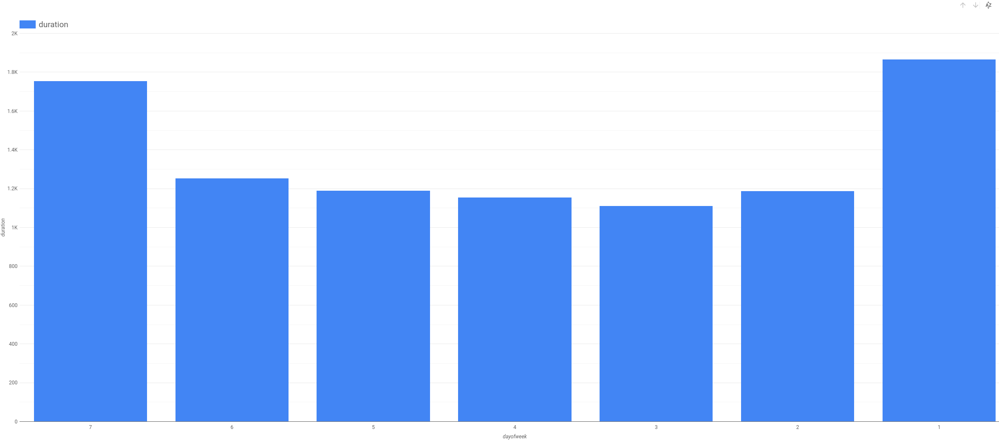
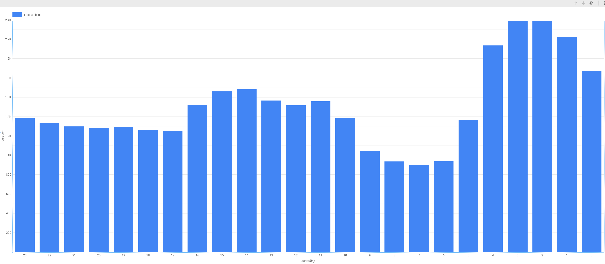

# BigQuery ML: Predict Bike Trip Duration with a Regresson Model in BQML 2.5

----
### Predict Bike Trip Duration with a Regresson Model in BQML 2.5

__ **Lab Overview**

- Uses the London bicycles dataset

- Covers the notion of labels and feature engineering

- Explore the data and identify potential features

- Create a linear regression model using the initial set of features

- Evaluate the model performance

- Modify the set of features using several techniques

- Re-train and re-evaluate the model

- Modify the feature set again and repeat the cycle until performance is
  acceptable

- View the model weights
..

__ **Explore dataset and identify potential features**

- Dataset:
    - `bigquery-public-data.london_bicycles.cycle_hire`

- Goal:
    - Predict bike trip duration

- Explore relationship between start_station_name and trip duration

    ```
        SELECT
            start_station_name,
            AVG(duration) AS duration,
        FROM
            `bigquery-public-data.london_bicycles.cycle_hire`
        GROUP BY start_station_name

    ```

- Create a Bar Chart to view how duration changes with start_station_name
    - metric: duration
    - dimension: start_station_name

- Similarly, explore graphically the impact of day of week, hour of day
  and duration:
    ```
        SELECT
            EXTRACT(dayofweek FROM start_date) AS dayofweek,
            AVG(duration) AS duration
        FROM
            `bigquery-public-data.london_bicycles.cycle_hire`
        GROUP BY dayofweek

        ---------------------

        SELECT
            EXTRACT(hourofday FROM start_date) AS hourofday,
            AVG(duration) AS duration
        FROM
            `bigquery-public-data.london_bicycles.cycle_hire`
        GROUP BY hourofday
    ```

- Explore graphically impact of number of bicycles:
    ```
        SELECT
            bikes_count,
            AVG(duration) AS duration
        FROM 
            `bigquery-public-data.london_bicycles.cycle_hire` JOIN
            `bigquery-public-data.london_bicycles.cycle_statons` ON
            cycle_hire.start_station_name = cycle_statons.name
        GROUP BY
            bikes_count
    ```

- _Tips when exploring data graphically for features:_

    - If metric doesn't change much as the dimension change then it's
      probably not a good feature

    - If metric changes randomly as the dimension changes then it's probably
      not a good feature

    - If the metric changes gradually as the dimension changes then it *is*
      likely a good feature

    - Use a sanity check for the domain.
..

__ **Create initial training dataset**

- Create a dataset in a region close to the data, in this case the EU
    - dataset name: `bike_model`
    - region: EU

- Create the model
    ```
        CREATE OR REPLACE MODEL
            bike_model.model                        -- model name
        OPTIONS (
            model_type='linear_reg`                 -- model type
            input_label_cols=['duration']           -- label
        )
        AS
        SELECT
            duration,
            start_station_name,
            CAST(EXTRACT(dayofweek FROM start_date) AS STRING) AS dayofweek,
            CAST(EXTRACT(hourofday FROM start_date) AS STRING) AS hourofday,
        FROM `bigquery-public-data.london_bicycles.cycle_hire`
    ```

- Columns `dayofweek` and `hourofday` are numeric values, CAST AS STRING
  to turn it into categorical values
..

__ **Evaluate initial model**

- Run query:
    ```
        SELECT * FROM ML.EVALUATE(MODEL `bike_model.model`)

    ```

- Check the mean absolute error
    - Value is 1025 secs (~17 mins)
    - This means the predicted bicycle rentals have an avg error of 17 mins.
..

__ **Improving the model and re-evaluate**

- Looking at the dayofweek graph:
    - 
    - There are two distinct groups i.e. Sat-Sun and Mon-Fri so perhaps
      grouping/combining the days of week will give a better feature.
    - This is an example of feature engineering

- Updated model
    ```
        CREATE OR REPLACE MODEL
            bike_model.model_weekday
        OPTIONS (
            model_type='linear_req',
            input_label_cols=['duration']
        )
        AS
        SELECT
            duration,
            start_station_name,
            IF (EXTRACT(dayofweek FROM start_date) BETWEEN 2 and 6,
                'weekday', 'weekend) AS dayofweek
            CAST(EXTRACT(hourofday FROM start_date) AS STRING) AS hourofday,
        FROM `bigquery-public-data.london_bicycles.cycle_hire`
    ```

- Re-evaluate the model
    ```
        SELECT * FROM ML.EVALUATE(MODEL `bike_model.model_weekday`)
    ```
..

__ **Improve the model further and re-evaluate**

- Analyzing the `hourofday` graph:
    - 
    - Perhaps grouping the hour of day into might be helpful
    - Into groups of: (-inf, 5), [5,10), [10,17), [17,inf)
    - Further feature engineering

- Revise the model
    ```
        CREATE OR REPLACE MODEL
            bike_model.model_bucketized
        OPTIONS (
            model_type='linear_reg',
            input_label_cols=['duration']
        )
        AS
        SELECT
            duration,
            start_station_name,
            IF (EXTRACT(dayofweek FROM start_date) BETWEEN 2 and 6,
                'weekday', 'weekend) AS dayofweek
            ML.BUCKETIZE(
                EXTRACT(hourofday FROM start_date),
                [5,10,17]) AS hourofday,
        FROM `bigquery-public-data.london_bicycles.cycle_hire`
    ```

- Evaluate the revised model
    ```
        SELECT * FROM ML.EVALUATE(MODEL `bike_model.model_bucketized`)
    ```
..

__ **Use the TRANSFORM to preprocess the final selected model**

- It moves the processing from the SELECT clause to the TRANSFORM clause

- Revised model
    ```
        CREATE OR REPLACE
            bike_model.model_bucketized
        TRANSFORM (
            * EXCEPT(start_date),                   -- All columns except start_date
            IF (EXTRACT(dayofweek FROM startdate)
                BETWEEN 2 and 6, 'weekday'          -- inclusive [2,3,4,5,6]
                'weekend' ) AS dayofweek,
            ML.BUCKETIZE(EXTRACT(hourofday FROM start_date),
                [5, 10, 17]) AS hourofday,
        )
        OPTIONS (
            model_type='linear_reg',
            input_label_cols=['duration']
        )
        AS
        SELECT
            duration,
            start_station_name,
            start_date
        FROM `bigquery-public-data.london_bicycles.cycle_hire`
    ```
..

__ **Predict using TRANSFORM-ed model**

- Run the prediction against a query:
    ```
        SELECT *
        FROM ML.PREDICT(
            MODEL bike_model.model_bucketized,
            ( SELECT
                'Park Lane , Hyde Park' AS start_station_name,
                CURRENT_TIMESTAMP() AS start_date
            )
        )
    ```

- Run the prediction against a table:
    ```
        SELECT *
        FROM ML.PREDICT(
            MODEL bike_mode.model_bucketized,
            ( SELECT
                start_station_name,
                start_date
              FROM `bigquery-public-data.london_bicycles.cycle_hire`
              LIMIT 100
            )
        )
    ```
..

__ **Examine model weights**

- Query the weights
    ```
        SELECT * FROM ML.WEIGHTS(MODEL bike_model.model_bucketized)
    ```

- The weights can then be exported elsewhere for deployment.
..

__ **Links**

- Course: Smart Analytics, Machine Learning, and AI on Google Cloud
    - https://www.cloudskillsboost.google/course_templates/55
    - [Sign In](https://www.cloudskillsboost.google/course_sessions/964554/labs/115208)

- BigQuery Machine Learning
    - https://cloud.google.com/bigquery/docs/bigqueryml-analyst-start

- ML.PREDICT Syntax
    - https://cloud.google.com/bigquery-ml/docs/reference/standard-sql/bigqueryml-syntax-predict

- ML.EVALUATE Syntax
    - https://cloud.google.com/bigquery-ml/docs/reference/standard-sql/bigqueryml-syntax-evaluate

- Manual Feature preprocessing - ML.BUCKETIZE
    - https://cloud.google.com/bigquery-ml/docs/reference/standard-sql/bigqueryml-preprocessing-functions#bucketize

- End-to-end journey for each model
    - https://cloud.google.com/bigquery-ml/docs/reference/standard-sql/bigqueryml-syntax-e2e-journey

..
