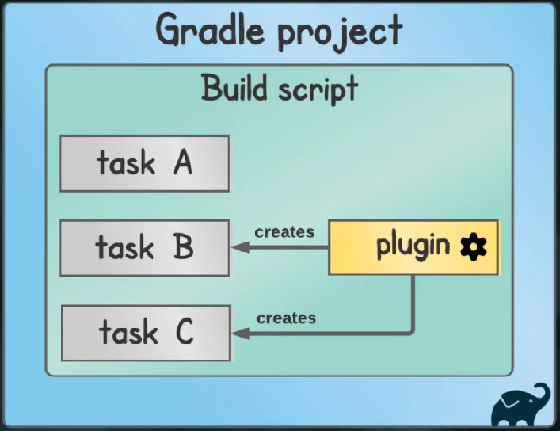

# Gradle Hello World

----
### Hello World

__ 1. Create the src/main/java/com/firexis/HelloWorld.java file
..

__ 2. Install gradle:

- Check java version
    - `java -version`

- Install from `https://gradle.org/install`
..

__ 3. Generate a project:

- In the project directory, run:
    - `gradle init`

- Select the various options

- And gradle creates the following in the directory:
    ```
        .gradle
        .gitattributes
        .gitignore
        build.gradle
        gradle
        gradlew
        gradlew.bat
        settings.gradle
    ```

..

__ 4. Add tasks/plugins to build.gradle

```
    plugins {
        id 'java'
    }
```
..

__ 5. Build and run the app:

- `./gradlew build`
    - Builds the app:
        - in `build/classes/java/main/com/firexis/HelloWorldclass`
        - in `build/libs/gradle-1-hello-world-20220424.jar`

- Run the class:
    - `cd build/classes/java/main`
    - `java com.firexis.HelloWorld`
    - `cd ../../../..`

- Run the jar file:
    - `java -jar build/libs/gradle-1-hello-world-20220424.jar`
    - Error:
        - no main manifest attribute, in build/libs/gradle-1-hello-world-20220424.jar
    - Solution
        - Need to add a 'Main-Class' to the JAR manifest
        - Configure the jar task
        ```
            jar {
                manifest {
                    attributes 'Main-Class': 'com.firexis.HelloWorld'
                }
            }
        ```
..

__ 6. Create tests

- Gradle expects tests in `src/test/java`

- Create directory for tests:
    - `mkdir -p src/test/java/com/firexis`

- Create test source file:
    - `vim src/test/java/com/firexis/HelloWorldTest.java`

- Update `build.gradle` to included the `junit` dependencies

- Update `build.gradle` to specify repositories to pull in `junit`

- Check the test results:
    - `build/reports/tests/test/index.html`
..

__ Notes

- Gradle
    - Is:
        - a build tool
        - for building Java applications
    - Motivation:
        - Compilation with dependencies is tedious when done manually
    - Does:
        - Compilation
        - Manages dependencies
    - Needs information:
        - type of application to build
        - library dependencies
        - other configuration or testing options
        - in a build script `build.gradle`
    - Advantages:
        - high performance
        - incremental build
        - advanced dependency management
        - automatically downloads dependencies
    - Compared to Maven
        - Maven started in 2004, Gradle in 2008
        - Maven uses XML, Gradle uses own less verbose syntax
        - Gradle has many custom plugins
        - Faster than maven

- Gradle Concepts
    - Projects
        - Project Container
    - Build scripts
        - One project, one build script
    - Tasks
        - One build script, many tasks
            - `./gradlew <task-name>`
        - Like npm tasks
    - Plugins
        - Adding plugins automatically add tasks to the build script
    - 

- Gradle tasks
    - `./gradlew tasks`
        - Lists the available tasks

- Groovy language
    - Runs on the JVM
    - Dynamic language
    - Gradle build scripts are written in Gradle Groovy DSL
    - Gradle uses just a subset of Groovy

- Gradle Conventions:
    - Expects source in `src/main/java`

- Commands:
    - `gradlew build`
        - Runs the build script `build.gradle`

- Compiling with jar files:
    - `javac -cp lib1.jar;lib2.jar;lib3.jar MyProgram.java`
    - Is untenable with lots of jar files
..

__ Groovy Notes

- No need to declare a class, use `def` keyword:

        def myVar = 'Executing as as script'

- Semi-colons not required:

        println myVar

- Brackets are optional, if function has at least one parameter

        def multiply(x, y) {
            println x*y
        }

        multiply 2, 3

- Define closures/lambdas using `{}`:

        def myClosure = {
            println 'Executing closure'
        }

        myClosure()
..

__ Links

- Gradle tutorial for complete beginners, 2021, 24:47 mins
    - https://www.youtube.com/watch?v=-dtcEMLNmn0

- Gradle course (Free)
    - https://learn.tomgregory.com/courses/get-going-with-gradle
..
