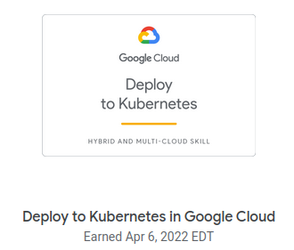
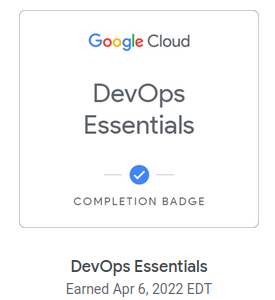
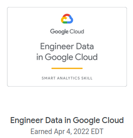
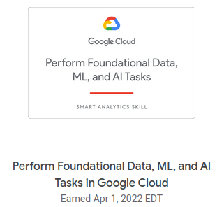
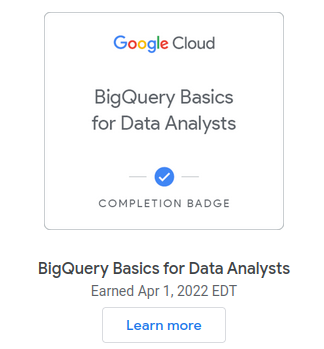
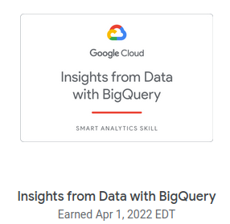
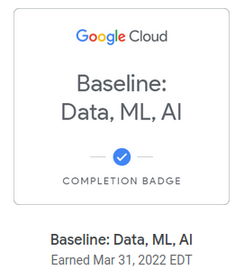
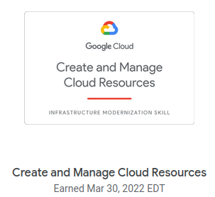
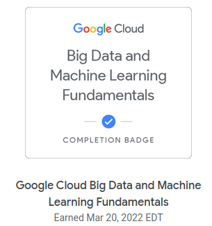

# Work Log
<small>A chronological log of the things I'm doing to get to my goal of becoming a Cloud Data Engineer.</small>

----
**Wed, 06 Apr 2022**
__

- Continued questing in ChaiyoGCP!. [web](https://events.withgoogle.com/chaiyogcp-challenge/home-english/#content)
    - Earned a Skill Badge
        - 
    - And a Completion Badge
        - 
    - Completed Activities today
        - Deploy to Kubernetes in Google Cloud: Challenge Lab
        - Deploy Kubernetes Load Balancer Service with Terraform
        - Troubleshooting Workloads on GKE for Site Reliability Engineers
        - Deploy Node.js Express Application in App Engine
        - Build and Launch an ASP.NET Core App from Google Cloud Shell
        - Deploy ASP.NET Core App to Kubernetes Engine
        - Deploying Memcached on Kubernetes Engine
        - Speech to Text Transcription with the Cloud Speech API
        - Translate Text with the Cloud Translation API
..

----
**Tue, 05 Apr 2022**
__

- Continued questing in ChaiyoGCP!. [web](https://events.withgoogle.com/chaiyogcp-challenge/home-english/#content)
    - Tied-up with something else today so completed very few labs
        - Setting up Jenkins on Kubernetes Engine
        - Continuous Delivery with Jenkins in Kubernetes Engine
..

----
**Mon, 04 Apr 2022**
__

- Continued questing in ChaiyoGCP!. [web](https://events.withgoogle.com/chaiyogcp-challenge/home-english/#content)
    - Completed a rather challenging Quest:
        - [Engineer Data in Google Cloud](https://www.cloudskillsboost.google/quests/132)
        - 
    - And a host of other labs:
        - Exploring Dataset Metadata Between Projects with Data Catalog
        - Build and Execute MySQL, PostgreSQL, and SQLServer to Data
          Catalog Connectors
        - Internet of Things: Qwik Start
        - Building an IoT Analytics Pipeline on Google Cloud
        - Predict Visitor Purchases with a Classification Model in BQML
        - Cloud Composer: Copying BigQuery Tables Across Different Locations
..

----
**Sun, 03 Apr 2022**
__

- Continued questing in ChaiyoGCP!. [web](https://events.withgoogle.com/chaiyogcp-challenge/home-english/#content)
    - Did the following labs:
        - Cloud Security Scanner: Qwik Start
        - Google Assistant: Qwik Start - Dialogflow
        - Cloud Endpoints: Qwik Start
        - Orchestrating the Cloud with Kubernetes
        - Managing Deployments Using Kubernetes Engine
        - Creating a Data Transformation Pipeline with Cloud Dataprep
        - ETL Processing on Google Cloud Using Dataflow and BigQuery
        - Using BigQuery in the Google Cloud Console
        - Data Catalog: Qwik Start
..

----
**Sat, 02 Apr 2022**
__

- Continued questing in ChaiyoGCP!. [web](https://events.withgoogle.com/chaiyogcp-challenge/home-english/#content)
    - Did more Infrastructure and DevOps type of labs today:
        - Introduction to Docker
        - Hello Node Kubernetes
        - Cloud Source Repositories: Qwik Start
        - Google Cloud SDK: Qwik Start - Redhat/Centos
        - App Engine: qwik Start - Python
        - Container-Optimized OS: Qwik Start
        - DataStore: Qwik Start
        - Cloud SQL for PostgreSQL: Qwik Start
        - Data Loss Prevention:Qwik Start - Command Line
        - Cloud Functions: Qwik Start - Command Line
    - Didn't finish any Quests but getting there :)
..

----
**Fri, 01 Apr 2022**
__

- Continued questing in ChaiyoGCP!. [web](https://events.withgoogle.com/chaiyogcp-challenge/home-english/#content)
    - Completed a quest: Perform Foundational Data, ML, and AI Tasks in Google Cloud
        - 
    - Completed a quest: BigQuery Basics for Data Analysts
        - 
    - Completed a quest: Insights from Data with BigQuery
        - 
    - See the latest badge profile [here](https://www.cloudskillsboost.google/public_profiles/70c3e8fe-77a0-45d9-a627-fa64f50ddafa)
..

----
**Thu, 31 Mar 2022**
__

- Continued course [Building Resilient Streaming Analytics Systems on Google Cloud](https://www.cloudskillsboost.google/course_templates/52)
    - Streaming processing is very interesting in it's own right
    - Notions of Windowing, Watermarks and Late Messages
    - Have not completed this course because got side-tracked by ChaiyoGCP!
- Taking part in ChaiyoGCP!.[web](https://events.withgoogle.com/chaiyogcp-challenge/home-english/#content)
    - Decided to focus on Data Engineering related Quests
- Completed a quest [Baseline: Data, ML, AI](https://www.cloudskillsboost.google/quests/34) as part of ChaiyoGCP!:
    - 
    - Did many labs today as part of the quest including DataPrep and
      Reinforcement Learning labs
    - The Vertex AI and Reinforcement Learning labs were quite over my
      head but I plan to revisit them when I have the chance
..

----
**Wed, 30 Mar 2022**
__

- Completed the quest [Create and Manage Cloud Resources](https://www.cloudskillsboost.google/quests/120)
    - 
    - It has a nice Challenge Lab to spin up Kubernetes clusters, and
      create load balancers which are typical cloud tasks.

- Started course [Building Resilient Streaming Analytics Systems on Google Cloud](https://www.cloudskillsboost.google/course_templates/52)
    - This is the third course in the Data Engineering on Google Cloud
      course series
..

----
**Tue, 29 Mar 2022**
__

- Completed course [Building Batch Data Pipelines on Google Cloud](https://www.cloudskillsboost.google/course_templates/53)
    - Pretty good intro to using BigQuery, Dataproc, DataFlow, Cloud
      Data Fusion (CDAP) and Cloud Composer (Apache Airflow) in building
      batch data pipelines
    - For some reason, my badge [profile](https://www.cloudskillsboost.google/public_profiles/70c3e8fe-77a0-45d9-a627-fa64f50ddafa) does not show the completion.. Maybe it will be eventually consistent :).
..

----
**Mon, 28 Mar 2022**
__

- Continue course [Building Batch Data Pipelines on Google Cloud](https://www.cloudskillsboost.google/course_templates/53)
    - Continue the third module: *Server Data Processing with Dataflow*
        - Was out of action for two days due to a Moderna booster jab
          that left me with a headache that preempted any kind of work
    - Spent some time learning Maven, which is needed in one of the
      labs. A quick intro to pom.xml files, Maven UIDs and maven
      archetypes.
    - Completed the third module: *Server Data Processing with Dataflow*
        - Quite a good intro to Dataflow and various concepts within it.
        - Apache BEAM still utilizes the concepts of MapReduce but the
          incantation is different and the pipeline nature of the pipe
          is very clear
        - The differentiator here could possibly be templates
        - The challenge of Map-Reduce is not complexity but scale. It
          requires a different way of thinking about problems i.e.
          largely by splitting things up and then grouping them back in
          a way that can be parallelized.
..

----
**Fri, 25 Mar 2022**
__

- Continue course [Building Batch Data Pipelines on Google Cloud](https://www.cloudskillsboost.google/course_templates/53)
    - Continue the second module: *Executing Spark on Dataproc*
        - Decided to spend more time on the lab, understanding it in more detail
    - Completed the second module: *Executing Spark on Dataproc*
        - The lab made sense after awhile. In a nutshell, starting
          clusters, using Jupyter to create a Python script, launching
          the script and monitoring jobs and stopping the cluster
    - Started the third module: *Server Data Processing with Dataflow*
        - Still trudging through it but the going is slow as I try to
          make sense of Apache Beam vs Apache Spark and compare and
          contrast them.
..

----
**Thu, 24 Mar 2022**
__

- Start course [Building Batch Data Pipelines on Google Cloud](https://www.cloudskillsboost.google/course_templates/53)
    - The second of four courses in the Data Engineering on Google Cloud
      course series. There are four modules in this course.
    - Started the first module: *Introduction to Building Batch Data Pipelines*
    - Completed the first module: *Introduction to Building Batch Data Pipelines*
        - Has some good slides on Data Quality
    - Started the second module: *Executing Spark on Dataproc*
    - I found the lab rather incomprehensible and instead drifted to get
      myself up to speed on Spark. Ended up looking at Databricks demos
      and reading up Lakehouses and so on.
    - Also, found similar courses on ACM Skillport. Microsoft Azure Data
      Fundamentals and Data Engineer is there. So are several other
      certifications from Amazon and Google. However, Google Data
      Engineer is not there.
..

----
**Wed, 23 Mar 2022**
__

- Completed the course: [Modernizing Data Lakes and Data Warehouses with Google Cloud](https://www.cloudskillsboost.google/course_templates/54)
    - 
    - I have a better appreciate of Google Cloud Storage and Google
      BigQuery as Google's Data Lake and Data Warehouse solutions
    - Demos in the course were nice and brisk
    - Lab's were ok, would be nice to have some "Challenge" questions
- The next course is [Building Batch Data Pipelines on Google Cloud](https://www.cloudskillsboost.google/course_templates/53)
    - Enough for today. I'll start on it tomorrow.
..

----
**Mon, 21 Mar 2022**
__

- Continue the course: [Modernizing Data Lakes and Data Warehouses with Google Cloud](https://www.cloudskillsboost.google/course_templates/54)
    - Started on *Building a Data lake*. The second of three modules.
    - Completed *Building a Data lake*. The second of three modules.
        - Materials are still rather haphazardly organized with lots of
          repetition. Lab is rather simplistic. Maybe because it's still
          introductory level. But then Data Lakes are rather simplistic
          just Extract and Load.
        - Found some interesting features of Cloud Storage though.
    - Started on *Building a Data Warehouse*. The last of three modules.
..

----
**Sun, 20 Mar 2022**
__

- Continued working on the Big Data and Machine Learning Fundamentals course
    - Start *The Machine Learning Workflow with Vertex AI*. The last of five modules.
    - [Completed](https://www.cloudskillsboost.google/public_profiles/70c3e8fe-77a0-45d9-a627-fa64f50ddafa/badges/1774516) the module and the course.
    - 
- Start the next course: [Modernizing Data Lakes and Data Warehouses with Google Cloud](https://www.cloudskillsboost.google/course_templates/54)
    - Start *Introduction to Data Engineering*. The first of three modules.
    - Completed *Introduction to Data Engineering*. The first of three modules.
        - This module feels rather haphazard
..

----
**Sat, 19 Mar 2022**
__

- Finished the [`Google Cloud Essentials`](https://www.cloudskillsboost.google/public_profiles/70c3e8fe-77a0-45d9-a627-fa64f50ddafa) course.
    - A fairly good intro to the Cloud Console and the very
      comprehensive `gcloud` CLI
    - I find that Google Cloud is more geared toward CLI usage, with the
      UI a bit unwieldy and this is actually quite fine. Azure portal on
      the other hand is more GUI centric probably which is also okay, I
      suppose but CLI is better for repeatability and scripting.

- Continued working on the Big Data and Machine Learning Fundamentals course
    - Finished the *Big Data with BigQuery* module. The third of five modules.
    - The [BigQuery demo](https://www.cloudskillsboost.google/course_sessions/887252/video/198822) was nicely done and the [BigQuery ML Lab](https://www.cloudskillsboost.google/course_sessions/887252/labs/198828) was very eye-opening (at least to me).
    - Start *Machine Learning Options on Google Cloud*. The fourth of five modules.
    - Completed *Machine Learning Options on Google Cloud*.
        - No lab in this module.
        - Mostly marketing materials covering the various ML/AI options
          and solutions that Google offers
..

----
**Fri, 18 Mar 2022**
__

- Continued auditing Week 1 of the [`Google Cloud Big Data and Machine
  Learning Fundamentals`](https://www.coursera.org/learn/gcp-big-data-ml-fundamentals)
  course on Coursera.
- Enrolled in the course yesterday.
- Decided to enroll in the [`BigQuery Basics for Data Analysts
  Quest`](https://www.qwiklabs.com/quests/69). A completion badge would
  some hands-on familiarity with BigQuery.
- Subscribed to the [`Data Engineer Learning Path`](https://www.cloudskillsboost.google/paths/16)

**Some Background**

- Actually I first enrolled in the [`Enterprise Database
  Migration`](https://www.coursera.org/learn/enterprise-database-migration)
  course but the pre-requisite for that is this BDML Fundamentals
  course.

- Prior to that I was planning to complete the [`IBM Data Engineering
  Professional
  Certificate`](https://www.coursera.org/professional-certificates/ibm-data-engineer).
  Started auditing the first course back, about two weeks ago, on 03 Mar
  2022. However, after auditing close to four (4) out of a total of
  thirteen (13) courses, I found some of the labs rather slow-going and
  cumbersome. The scope is also very much traditional Data Warehousing.
  I think the opportunities these days are in Cloud Data Analytics with
  notions of data-lakes, auto-scaling and machine learning.

- I find the BDML Fundamentals course is more interesting, broadening
  the scope of what is possible. The customer use-cases were definitely
  very motivating. I might still go back to do some of the IBM courses
  but perhaps later.
..

