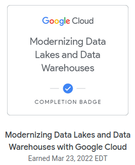

# Work Log
<small>A chronological log of the things I'm doing to get to my goal of becoming a Cloud Data Engineer.</small>

----
**Wed, 23 Mar 2022**
__

- Completed the course: [Modernizing Data Lakes and Data Warehouses with Google Cloud](https://www.cloudskillsboost.google/course_templates/54)
    - 
    - I have a better appreciate of Google Cloud Storage and Google
      BigQuery as Google's Data Lake and Data Warehouse solutions
    - Demos in the course were nice and brisk
    - Lab's were ok, would be nice to have some "Challenge" questions
- The next course is [Building Batch Data Pipelines on Google Cloud](https://www.cloudskillsboost.google/course_templates/53)
    - Enough for today. I'll start on it tomorrow.
..

----
**Mon, 21 Mar 2022**
__

- Continue the course: [Modernizing Data Lakes and Data Warehouses with Google Cloud](https://www.cloudskillsboost.google/course_templates/54)
    - Started on *Building a Data lake*. The second of three modules.
    - Completed *Building a Data lake*. The second of three modules.
        - Materials are still rather haphazardly organized with lots of
          repetition. Lab is rather simplistic. Maybe because it's still
          introductory level. But then Data Lakes are rather simplistic
          just Extract and Load.
        - Found some interesting features of Cloud Storage though.
    - Started on *Building a Data Warehouse*. The last of three modules.
..

----
**Sun, 20 Mar 2022**
__

- Continued working on the Big Data and Machine Learning Fundamentals course
    - Start *The Machine Learning Workflow with Vertex AI*. The last of five modules.
    - [Completed](https://www.cloudskillsboost.google/public_profiles/70c3e8fe-77a0-45d9-a627-fa64f50ddafa/badges/1774516) the module and the course.
    - 
- Start the next course: [Modernizing Data Lakes and Data Warehouses with Google Cloud](https://www.cloudskillsboost.google/course_templates/54)
    - Start *Introduction to Data Engineering*. The first of three modules.
    - Completed *Introduction to Data Engineering*. The first of three modules.
        - This module feels rather haphazard
..

----
**Sat, 19 Mar 2022**
__

- Finished the [`Google Cloud Essentials`](https://www.cloudskillsboost.google/public_profiles/70c3e8fe-77a0-45d9-a627-fa64f50ddafa) course.
    - A fairly good intro to the Cloud Console and the very
      comprehensive `gcloud` CLI
    - I find that Google Cloud is more geared toward CLI usage, with the
      UI a bit unwieldy and this is actually quite fine. Azure portal on
      the other hand is more GUI centric probably which is also okay, I
      suppose but CLI is better for repeatability and scripting.

- Continued working on the Big Data and Machine Learning Fundamentals course
    - Finished the *Big Data with BigQuery* module. The third of five modules.
    - The [BigQuery demo](https://www.cloudskillsboost.google/course_sessions/887252/video/198822) was nicely done and the [BigQuery ML Lab](https://www.cloudskillsboost.google/course_sessions/887252/labs/198828) was very eye-opening (at least to me).
    - Start *Machine Learning Options on Google Cloud*. The fourth of five modules.
    - Completed *Machine Learning Options on Google Cloud*.
        - No lab in this module.
        - Mostly marketing materials covering the various ML/AI options
          and solutions that Google offers
..

----
**Fri, 18 Mar 2022**
__

- Continued auditing Week 1 of the [`Google Cloud Big Data and Machine
  Learning Fundamentals`](https://www.coursera.org/learn/gcp-big-data-ml-fundamentals)
  course on Coursera.
- Enrolled in the course yesterday.
- Decided to enroll in the [`BigQuery Basics for Data Analysts
  Quest`](https://www.qwiklabs.com/quests/69). A completion badge would
  some hands-on familiarity with BigQuery.
- Subscribed to the [`Data Engineer Learning Path`](https://www.cloudskillsboost.google/paths/16)

**Some Background**

- Actually I first enrolled in the [`Enterprise Database
  Migration`](https://www.coursera.org/learn/enterprise-database-migration)
  course but the pre-requisite for that is this BDML Fundamentals
  course.

- Prior to that I was planning to complete the [`IBM Data Engineering
  Professional
  Certificate`](https://www.coursera.org/professional-certificates/ibm-data-engineer).
  Started auditing the first course back, about two weeks ago, on 03 Mar
  2022. However, after auditing close to four (4) out of a total of
  thirteen (13) courses, I found some of the labs rather slow-going and
  cumbersome. The scope is also very much traditional Data Warehousing.
  I think the opportunities these days are in Cloud Data Analytics with
  notions of data-lakes, auto-scaling and machine learning.

- I find the BDML Fundamentals course is more interesting, broadening
  the scope of what is possible. The customer use-cases were definitely
  very motivating. I might still go back to do some of the IBM courses
  but perhaps later.
..

